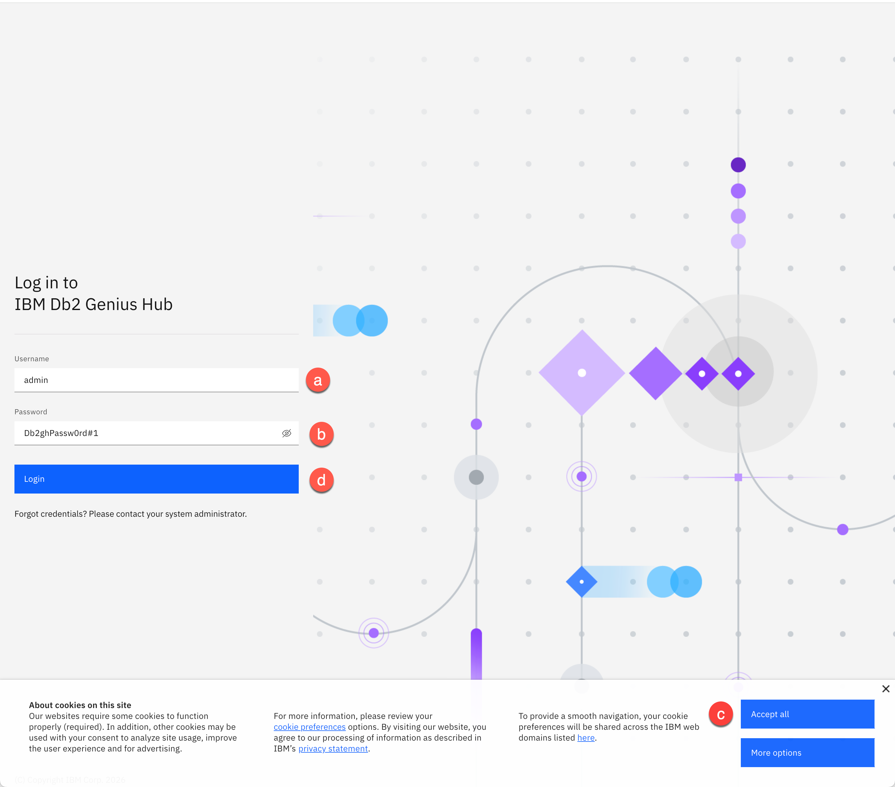
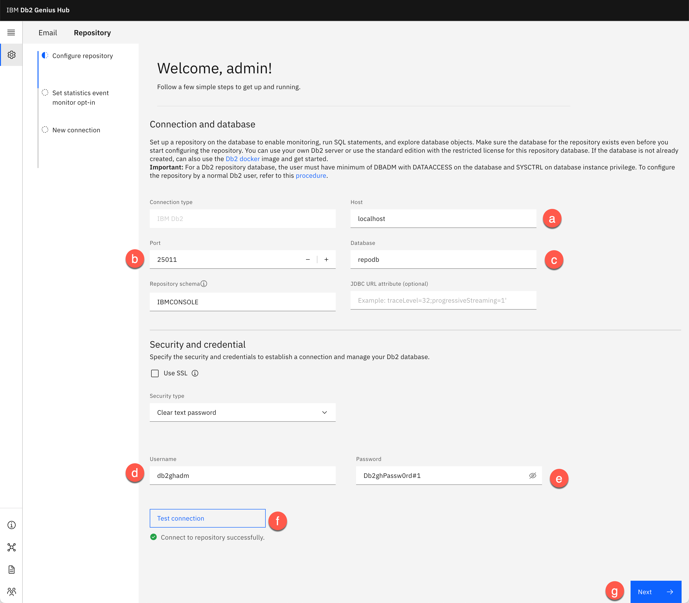
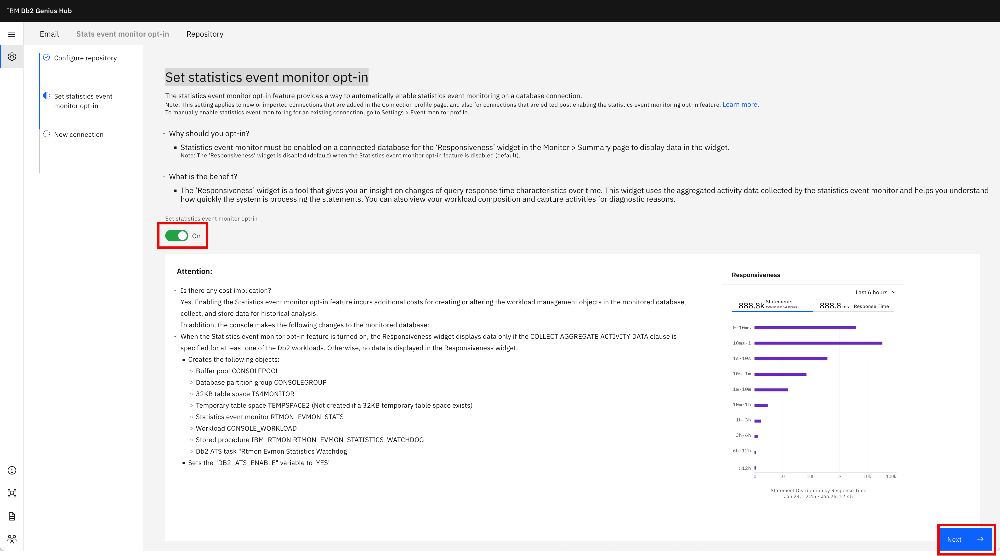
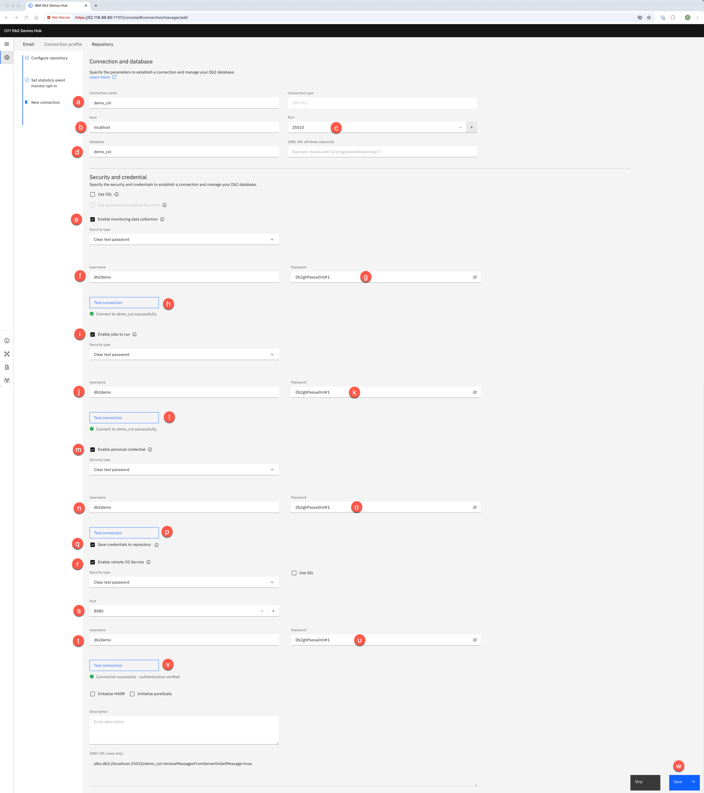
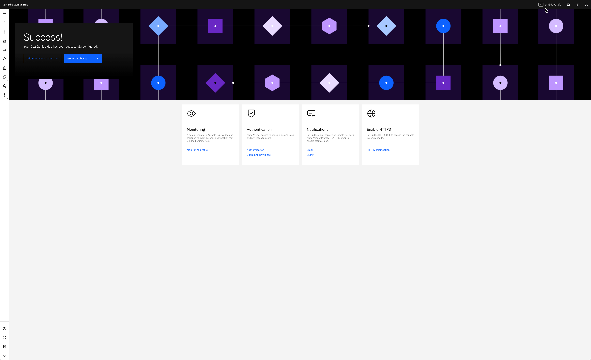

<h1 style="padding-left:16px; border-left:8px solid #378ADD;">2.1 — Login and Repository Setup</h1>

Open a browser (Google Chrome, Mozilla Firefox, Microsoft Edge, or Safari) and navigate to the Db2 Genius Hub URL provided by your instructor.

> **📋 Reference:** See [Section 1.2 Accessing the Lab Environment](01-setup.md#accessing-the-lab-environment) for the URL.

Enter your credentials and click **Login**:

| Field | Value |
|---|---|
| Username *(a)* | `admin` |
| Password *(b)* | `Db2ghPassw0rd#1` |

Click **Accept all** *(c)*, then click **Login** *(d)*.

> **⚠️ Caution:** Be careful when typing the password. After 3 incorrect attempts, the username will be locked and all users running this lab will be locked out.

---

<h2 style="padding-left:14px; border-left:6px solid #1D9E75;">Configure Repository (First Login Setup)</h2>

At first login, you must configure the repository database to initialize the IBM Db2 Genius Hub environment.

<h3 style="padding-left:14px; border-left:5px solid #EF9F27;">Step 1 — Configure Repository</h3>

After logging in, you will be automatically taken to the **Configure repository** page.

**Connection and database:**

| Label | Field | Value |
|---|---|---|
| **a** | Host | `localhost` |
| **b** | Port | `25011` |
| **c** | Database | `REPODB` |
| — | Repository schema | `IBMCONSOLE` (default) |
| — | JDBC URL attribute | *(leave empty)* |

**Security and credential:**

| Label | Field | Value |
|---|---|---|
| — | Use SSL | ☐ Unchecked |
| — | Security type | Clear text password |
| **d** | Username | `db2ghadm` |
| **e** | Password | `Db2ghPassw0rd#1` |

Click **Test connection** *(f)* to validate. When successful:

> ✅ *Connect to repository successfully.*

> **ℹ️ Note:** This process may take a few minutes as all `REPODB` database objects are being created.

Click **Next** *(g)* to continue.

---

<h3 style="padding-left:14px; border-left:5px solid #EF9F27;">Step 2 — Set Statistics Event Monitor Opt-In</h3>

Enable the **Set statistics event monitor opt-in** option by switching the toggle to **On**.

This feature automatically enables statistics event monitoring on database connections and is required for the **Responsiveness** widget on the Monitor > Summary page to display data.

> **ℹ️ Note:** Enabling this option creates additional Db2 objects and may incur additional resource usage.

Click **Next** to continue.

---

<h3 style="padding-left:14px; border-left:5px solid #EF9F27;">Step 3 — Connection and Database</h3>

Configure the connection parameters to establish a connection to your Db2 database.

**Connection and database:**

| Label | Field | Value |
|---|---|---|
| **a** | Connection name | `demo_col` |
| **b** | Host | `localhost` |
| **c** | Port | `25010` |
| **d** | Database | `demo_col` |

**Security and credential:**

| Label | Field | Value |
|---|---|---|
| **e** | Enable monitoring data collection | ☑ Checked |
| **f** | Username | `db2demo` |
| **g** | Password | `Db2ghPassw0rd#1` |

Click **Test connection (h)** → *Connect to demo_col successfully.*

**Enable Jobs to Run:**

| Label | Field | Value |
|---|---|---|
| **i** | Enable jobs to run | ☑ Checked |
| **j** | Username | `db2demo` |
| **k** | Password | `Db2ghPassw0rd#1` |

Click **Test connection (l)** → *Connect to demo_col successfully.*

**Enable Personal Credential:**

| Label | Field | Value |
|---|---|---|
| **m** | Enable personal credential | ☑ Checked |
| **n** | Username | `db2demo` |
| **o** | Password | `Db2ghPassw0rd#1` |

Select **Save credentials to repository (q)**.

Click **Test connection (p)** → *Connect to demo_col successfully.*

Click **Save (r)** to save the connection.

> **ℹ️ Note:** The Agentic AI Service and Anomaly Detection Service will be `STOPPED` and will be enabled later in this lab.

After clicking **Save**, you will be brought to the **Success!** page. Click **Go to Databases** to proceed.

> ✅ This completes the Setup and Configuration section.

---

---

**[← Section 1: Setup](01-setup.md)** &nbsp;&nbsp;|&nbsp;&nbsp; **[→ 2.2: Interface Tour](02-02-interface-tour.md)**

---
