<h1 style="padding-left:16px; border-left:8px solid #378ADD;">2.2 — Interface Tour</h1>

<h3 style="padding-left:14px; border-left:5px solid #EF9F27;">Home Page</h3>

The Db2 Genius Hub home page provides a summary of all databases being monitored, showing alerts, key insights, and the list of database connections.

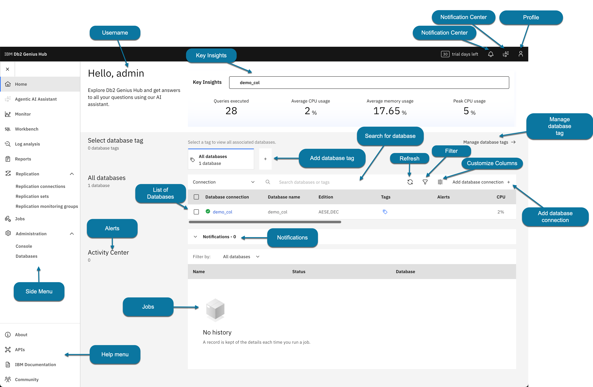

---

<h3 style="padding-left:14px; border-left:5px solid #EF9F27;">Key Insights Section</h3>

In the upper-middle section, Db2 Genius Hub shows performance metrics for five databases:

- Queries being executed
- Average CPU usage
- Average memory usage
- Peak CPU usage

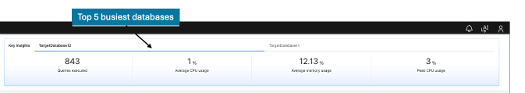

---

<h3 style="padding-left:14px; border-left:5px solid #EF9F27;">Heading Icons</h3>

In the upper-right corner you'll find 4 icon buttons. The **Notification Center (Alerts)** and **Database Assistant** will be explored in more detail later in the lab.

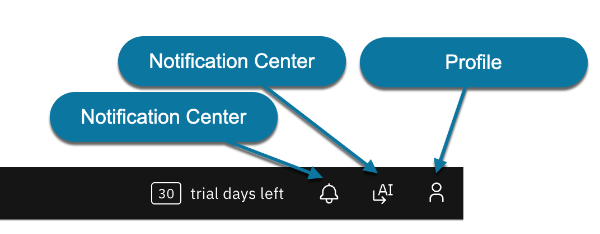

---

<h3 style="padding-left:14px; border-left:5px solid #EF9F27;">Exploring the Menus</h3>

<h4 style="padding-left:14px; border-left:4px solid #888780;">Side Menu</h4>

During the labs, you will use the side menu to access all major features. Click the **hamburger menu (☰)** on the top left to expand.

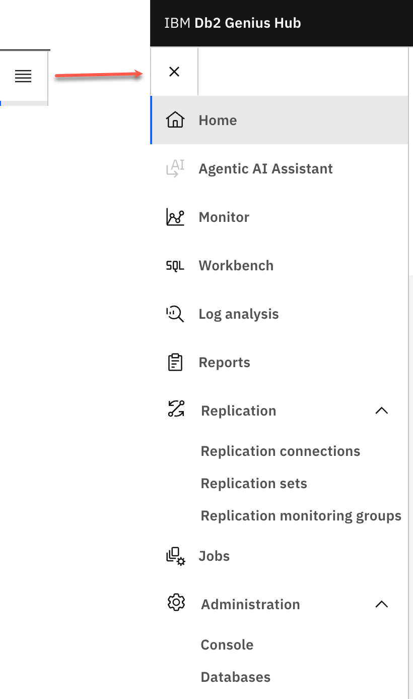

---

<h4 style="padding-left:14px; border-left:4px solid #888780;">Help Menu</h4>

On the lower-left side of the home page, you'll find 4 icons:

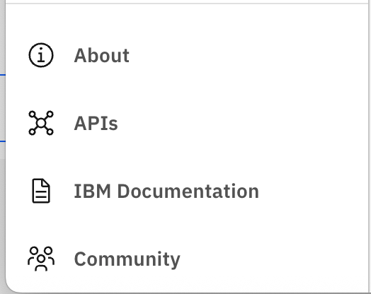

<h4 style="padding-left:14px; border-left:4px solid #888780;">About</h4>

1. From the help menu, click **About (a)**.

   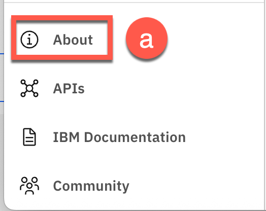

2. The Db2 Genius Hub information panel opens, showing the release number and build date. Click **Close (a)**.

   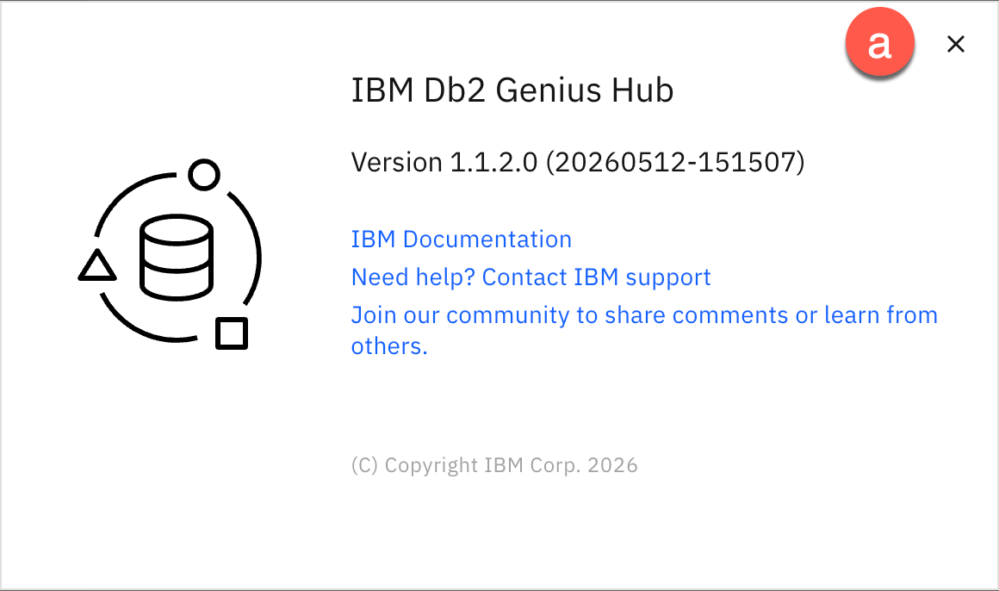

---

<h4 style="padding-left:14px; border-left:4px solid #888780;">APIs</h4>

1. From the help menu, click **APIs (b)**.

   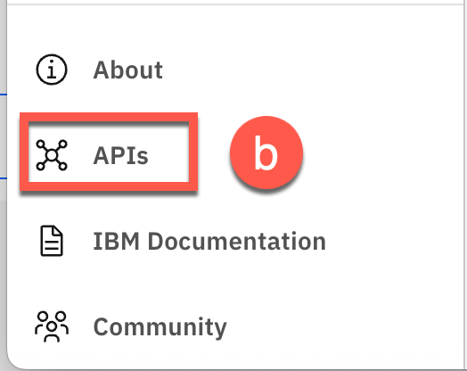

2. The REST APIs window opens. Db2 Genius Hub provides REST APIs for configuration changes, monitoring, and integration. Common use cases include:

   | Use Case | Description |
   |---|---|
   | **Bulk password updates** | When an instance password changes, update all databases under that instance in one API call |
   | **Dynamic blackout windows** | Pause monitoring before a maintenance window and resume it afterward |

3. The REST API window also provides usage examples in: Payload, Curl, Go, Java, Node, and Python.

   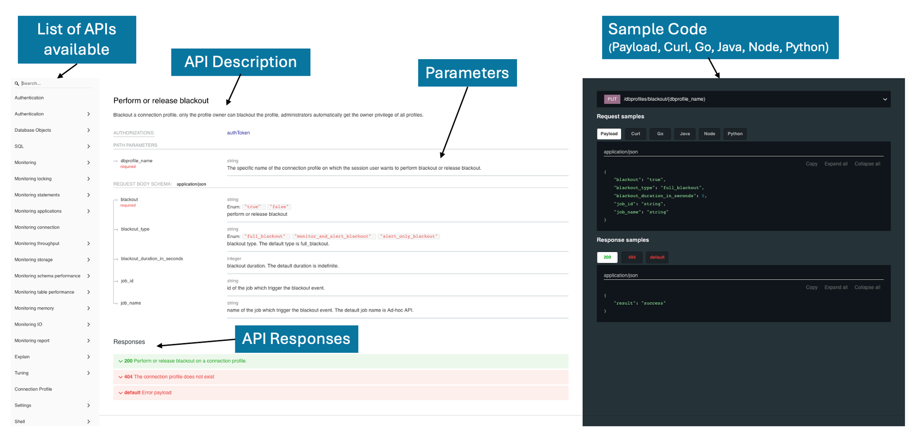

   > **📖 Reference:** [Db2 Genius Hub API Documentation](https://www.ibm.com/docs/en/dic?topic=working-with-apis)

---

<h4 style="padding-left:14px; border-left:4px solid #888780;">IBM Documentation</h4>

1. From the help menu, click **IBM Documentation (c)**.

   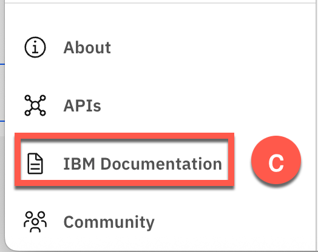

2. The IBM Db2 Genius Hub Knowledge Center opens.

   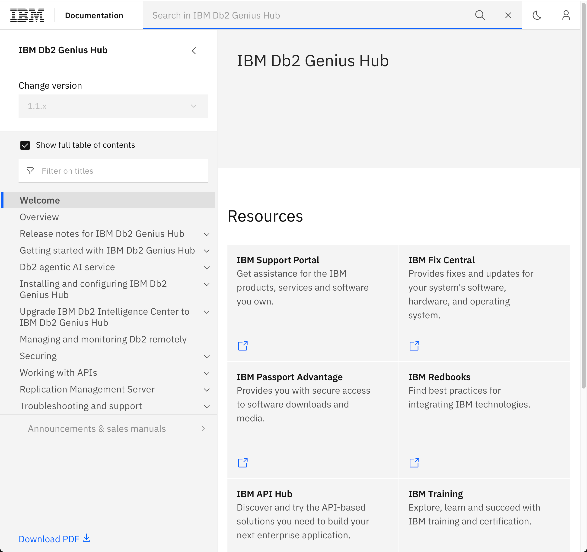

---

<h4 style="padding-left:14px; border-left:4px solid #888780;">Community</h4>

1. From the help menu, click **Db2 Community page (d)**.

   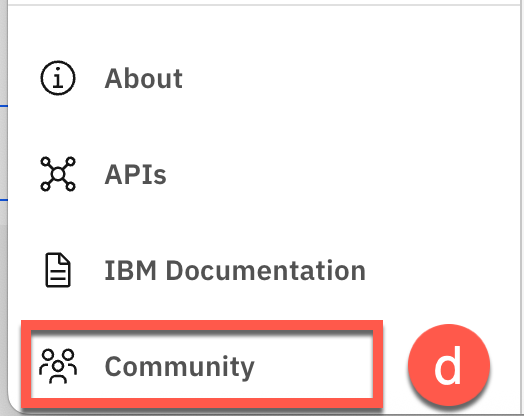

2. The Db2 Community page opens. The Db2 Community is very active — post questions, browse announcements, and find informative webinars covering several IBM Db2 products.

   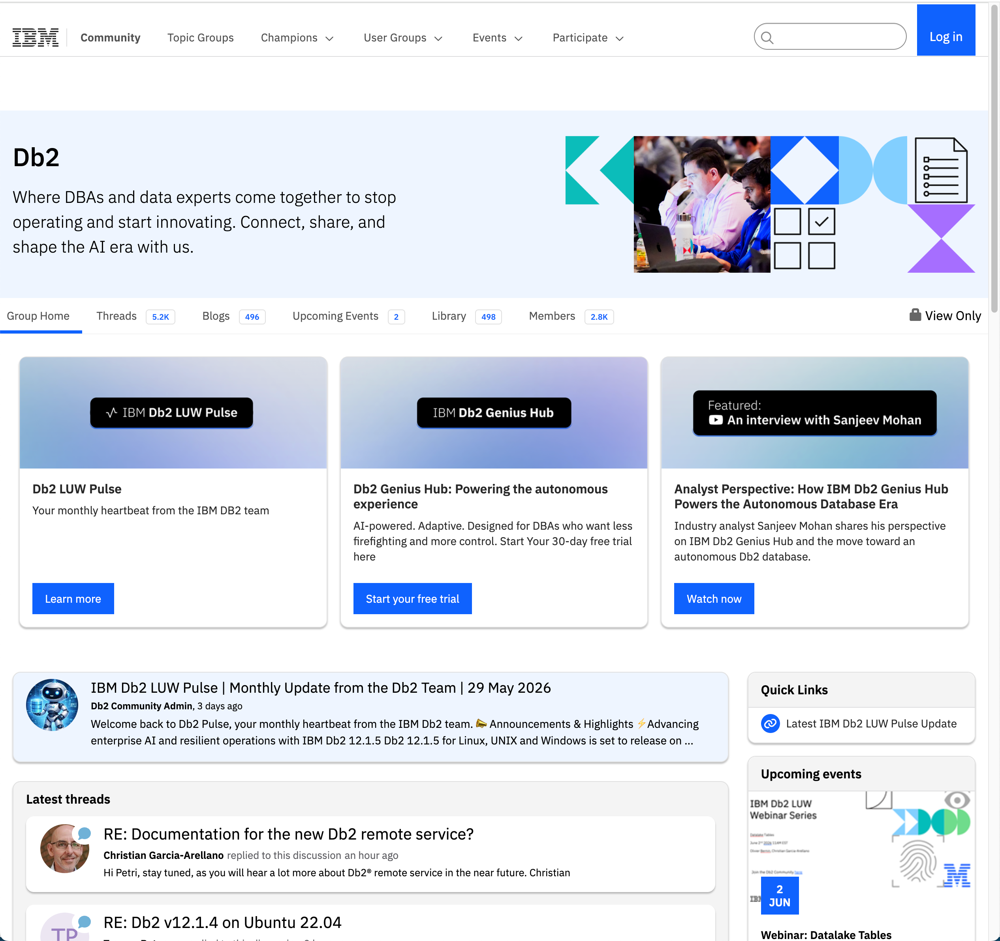

---

---

**[← 2.1: Login and Repo Setup](02-01-login-and-repo.md)** &nbsp;&nbsp;|&nbsp;&nbsp; **[→ 2.3: Database Connections](02-03-database-connections.md)**

---
