<h1 style="padding-left:16px; border-left:8px solid #378ADD;">Database Connections</h1>

From the side menu, go to the Db2 Genius Hub home page **(a)**.

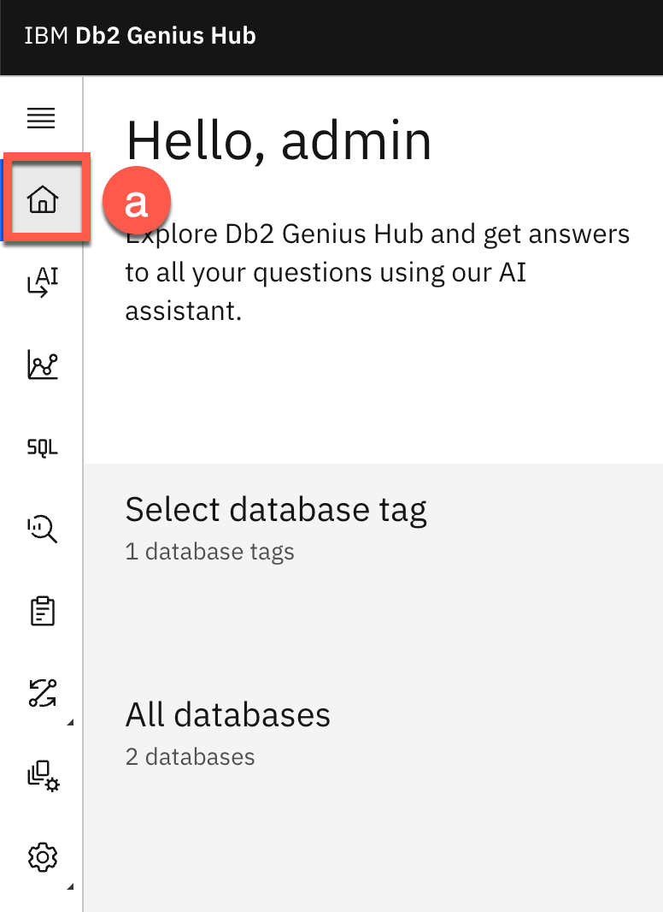

---

<h3 style="padding-left:14px; border-left:5px solid #EF9F27;">Database Tags</h3>

Db2 Genius Hub allows you to tag databases to separate views by group — for example, by department, data center, or criticality. Selecting a tag filters the database list to show only databases assigned to that tag.

> **⏳ Wait** until the `demo_col` database shows a green checkmark before proceeding.

**Create a tag:**

1. Click **+ (a)** next to the "All databases" tab. The **Create tag** window opens.

   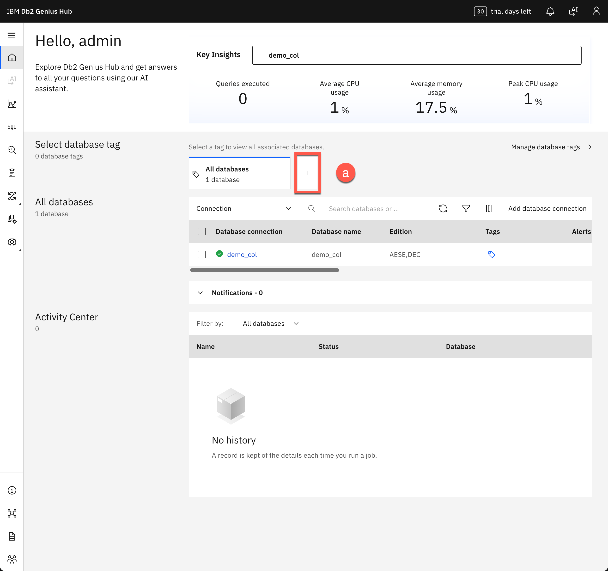

   > **ℹ️ Note:** You can also change the display order of tags by clicking **Manage database tags**.

2. Enter the tag name: `columnar` **(b)** and click **Add database + (c)**.

   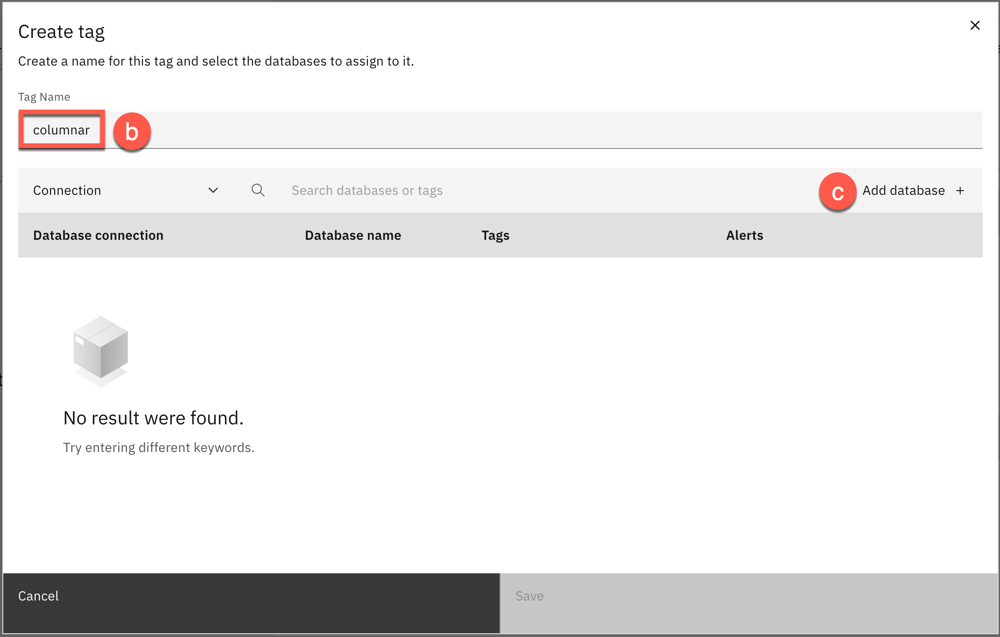

3. Select the **`demo_col`** database **(d)** and click **Save (e)**.

   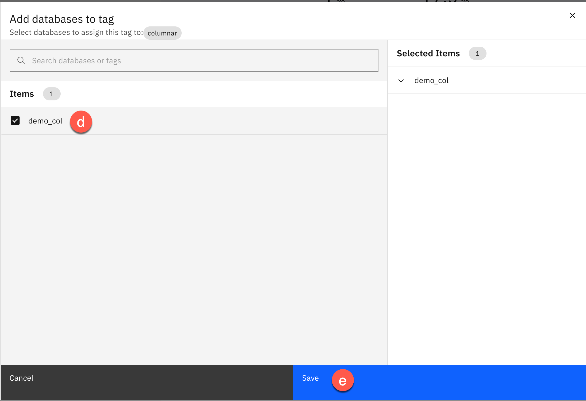

4. Click **Save (f)**.

   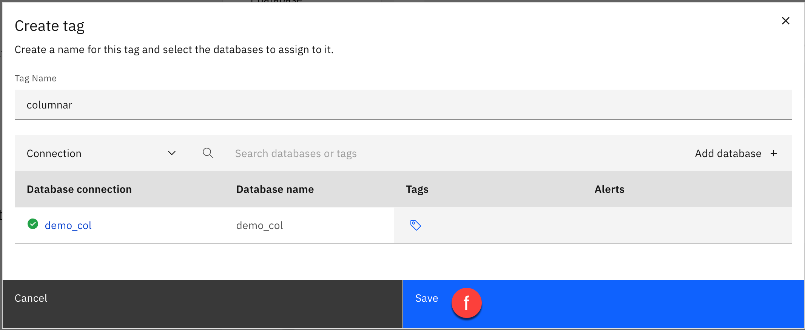

---

<h3 style="padding-left:14px; border-left:5px solid #EF9F27;">Customize Columns</h3>

The database list shows all monitored databases with a summary of their main metrics. You can add or remove metrics from this view.

1. Click **Customize Columns (a)**.

   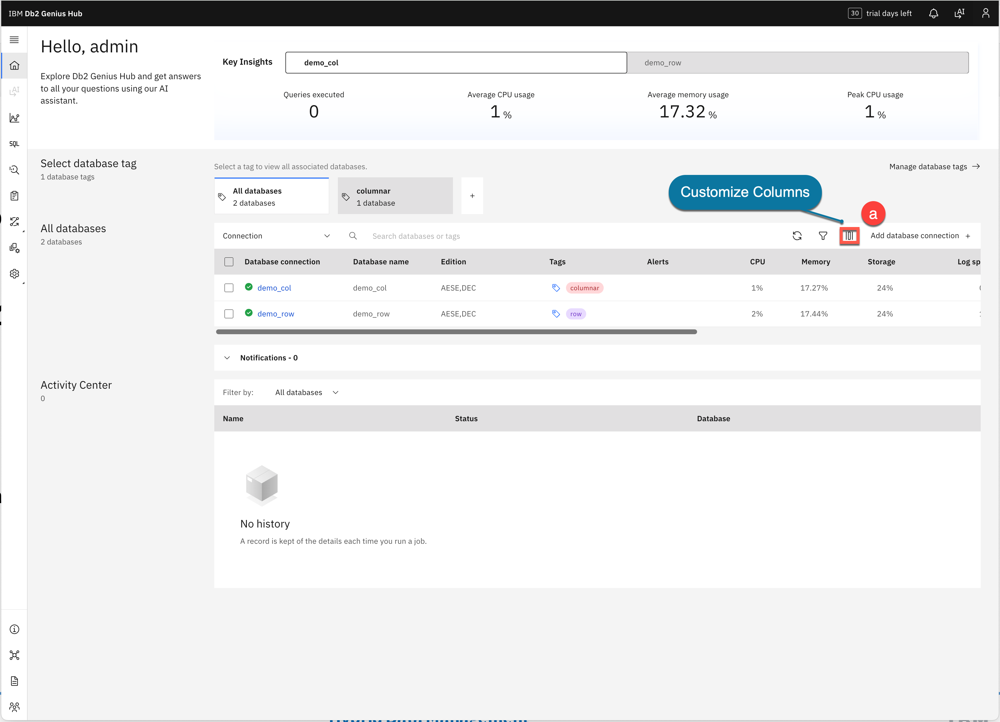

2. Scroll down the list, select **Server type and version (b)**, and click **Apply (c)**.

   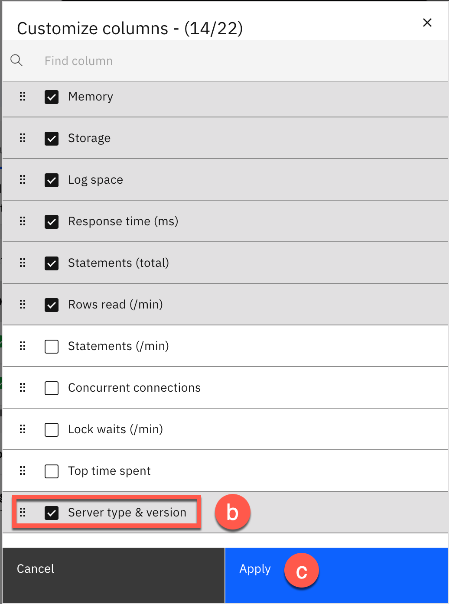

3. The **Server type & version** column is now displayed. Use the up/down arrows on each column header to sort.

   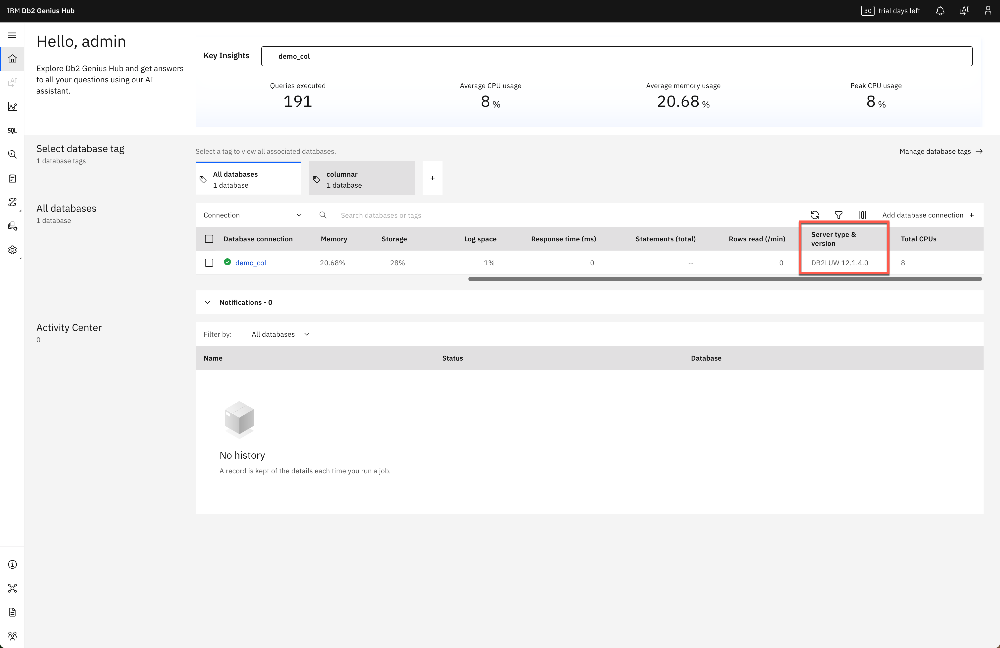

---

<h3 style="padding-left:14px; border-left:5px solid #EF9F27;">Add a Database</h3>

Add the other pre-defined database for this lab.

1. Click **Add database connection (a)**.

   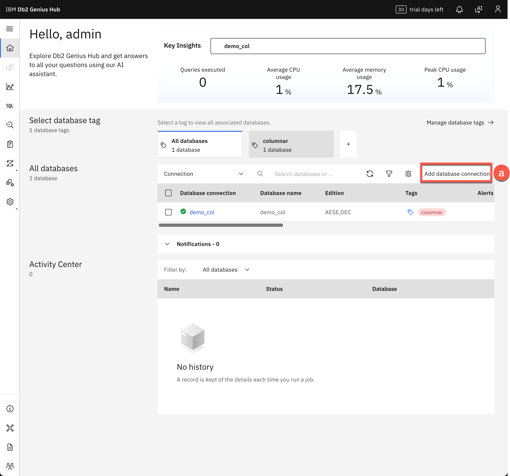

2. Enter the following details:

   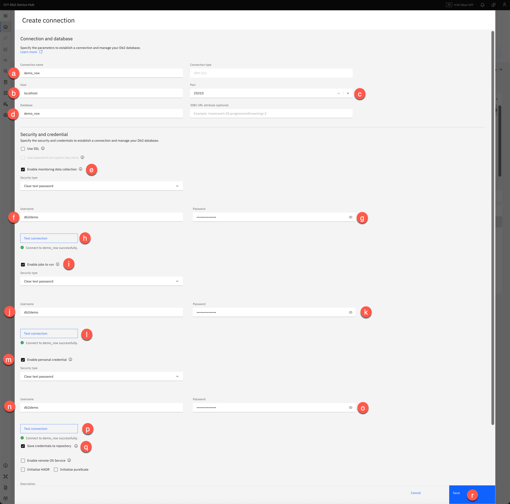

   **Connection and database:**

   | Label | Field | Value |
   |---|---|---|
   | **a** | Connection name | `demo_row` |
   | **b** | Host | `localhost` |
   | **c** | Port | `25010` |
   | **d** | Database | `demo_row` |

   **Security and credential:**

   | Label | Field | Value |
   |---|---|---|
   | **e** | Enable monitoring data collection | ☑ Checked |
   | **f** | Username | `db2demo` |
   | **g** | Password | `Db2ghPassw0rd#1` |

   Click **Test connection (h)** → *Connect to demo_row successfully.*

   **Enable Jobs to Run:**

   | Label | Field | Value |
   |---|---|---|
   | **i** | Enable jobs to run | ☑ Checked |
   | **j** | Username | `db2demo` |
   | **k** | Password | `Db2ghPassw0rd#1` |

   Click **Test connection (l)** → *Connect to demo_row successfully.*

   **Enable Personal Credential:**

   | Label | Field | Value |
   |---|---|---|
   | **m** | Enable personal credential | ☑ Checked |
   | **n** | Username | `db2demo` |
   | **o** | Password | `Db2ghPassw0rd#1` |

   Select **Save credentials to repository (q)**.

   Click **Test connection (p)** → *Connect to demo_row successfully.*

   Click **Save (r)** to save the connection.

3. Reload the browser to display the newly added database.

---

<h3 style="padding-left:14px; border-left:5px solid #EF9F27;">Add a Tag to the New Database</h3>

1. Wait until `demo_row` shows a green checkmark. Click **+ (a)** next to the "columnar" tab.

   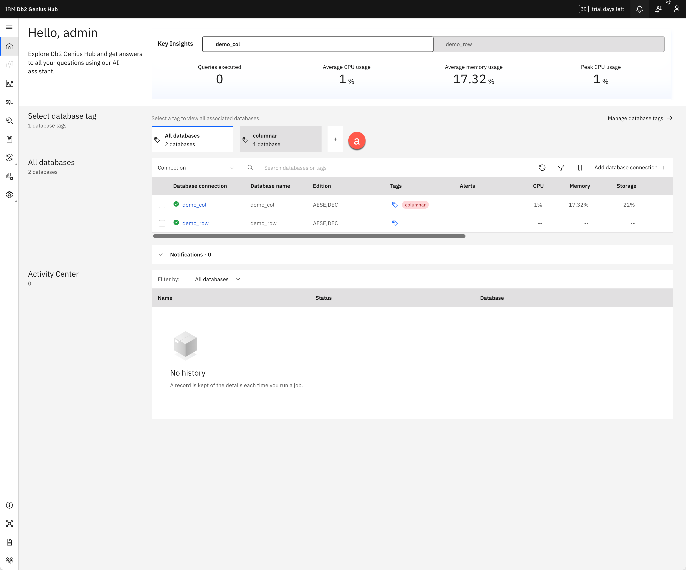

2. Enter the tag name: `row` **(b)** and click **Add database + (c)**.

   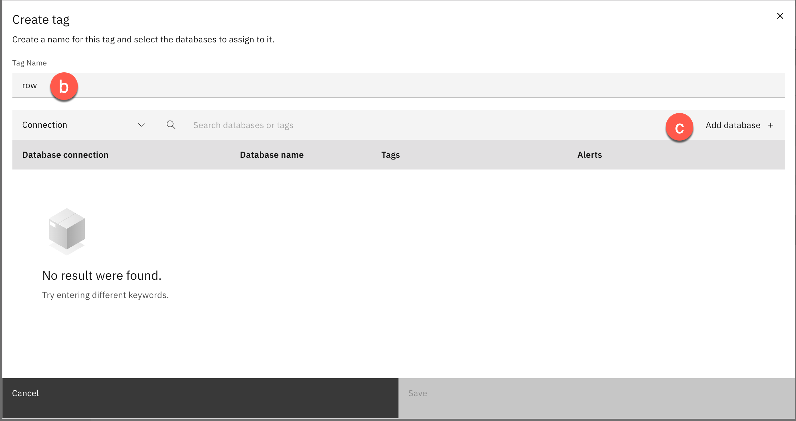

3. Select the **`demo_row`** database **(d)** and click **Save (e)**.

   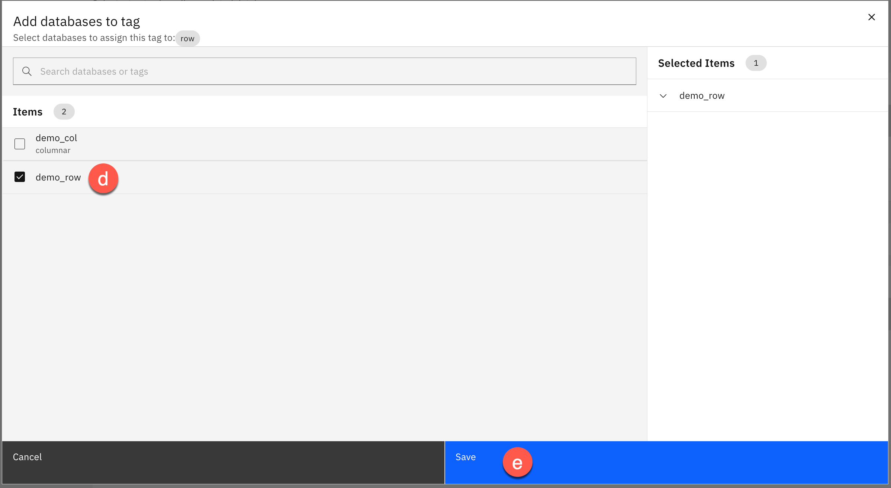

4. Click **Save (f)**.

   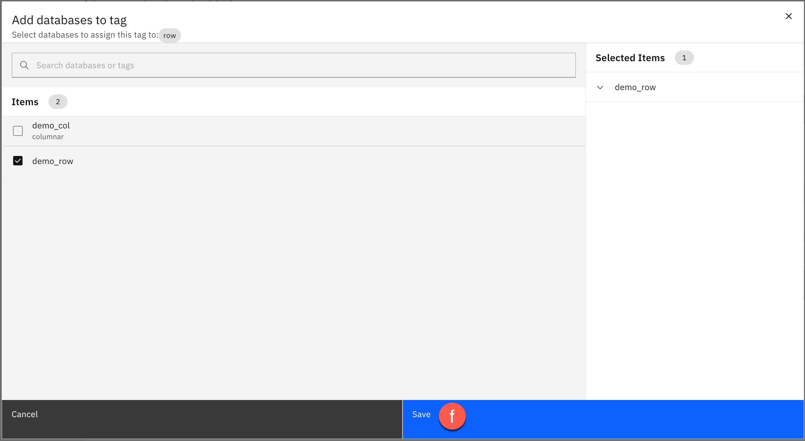

The **All databases** section now shows two databases: `demo_col` and `demo_row`.

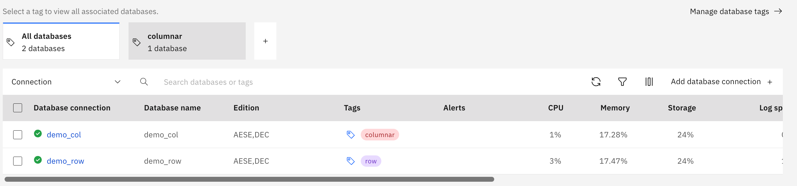

---

---

**[← 2.2: Interface Tour](02-02-interface-tour.md)** &nbsp;&nbsp;|&nbsp;&nbsp; **[→ 2.4: Monitor Dashboard](02-04-monitor-dashboard.md)**

---
