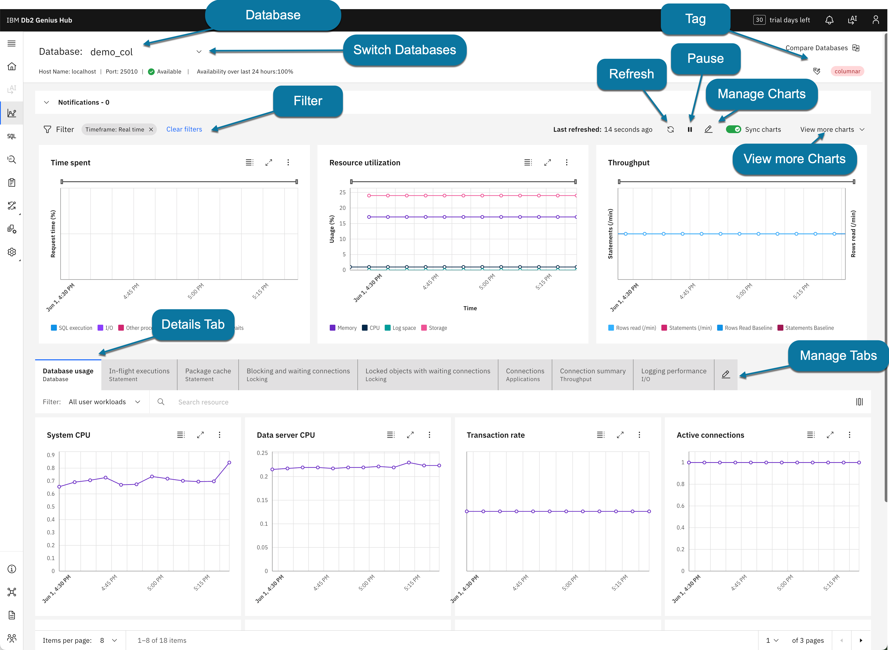
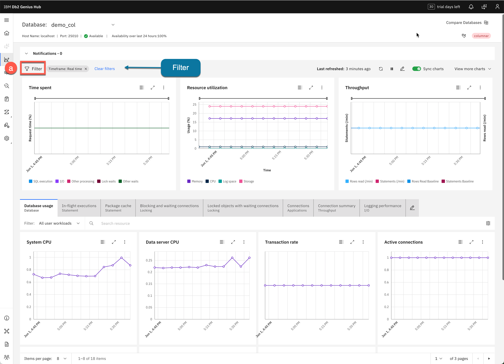
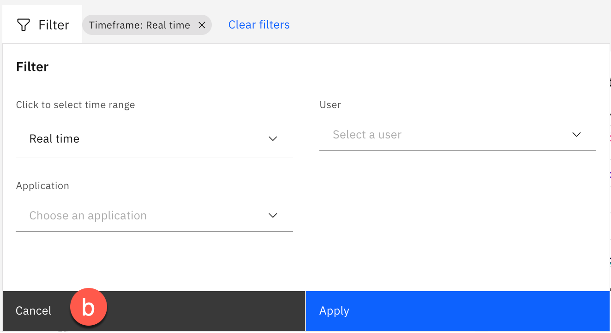
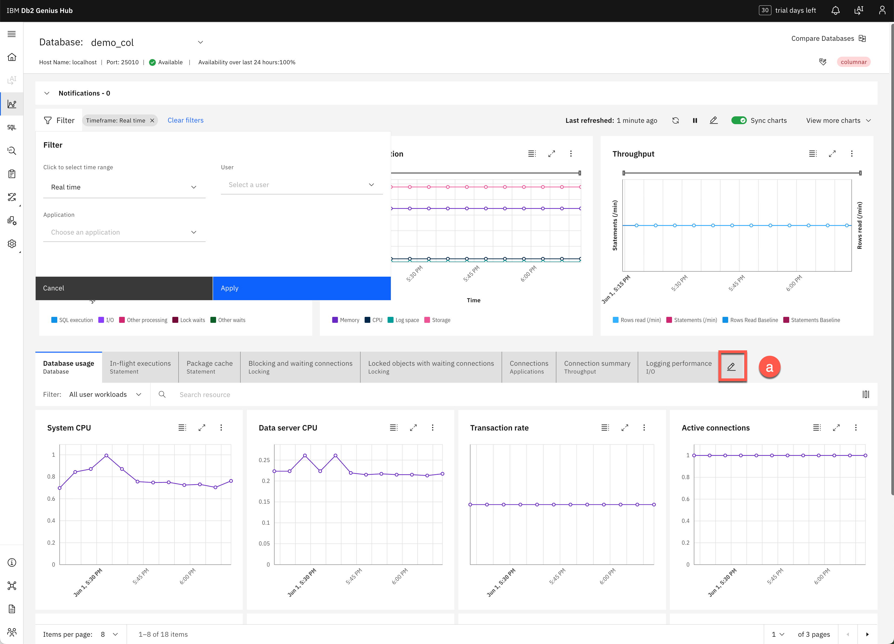
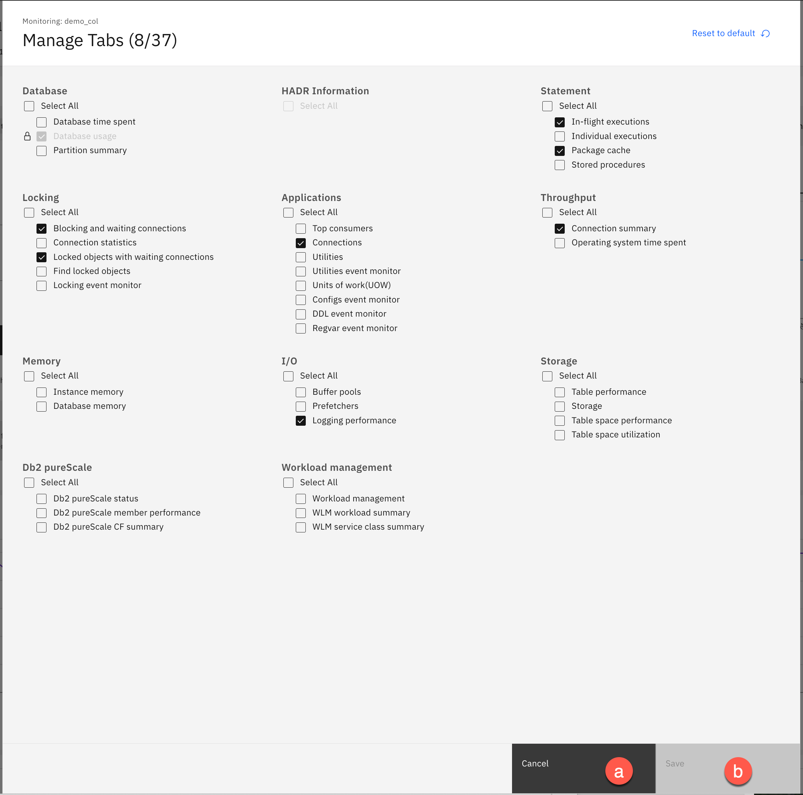
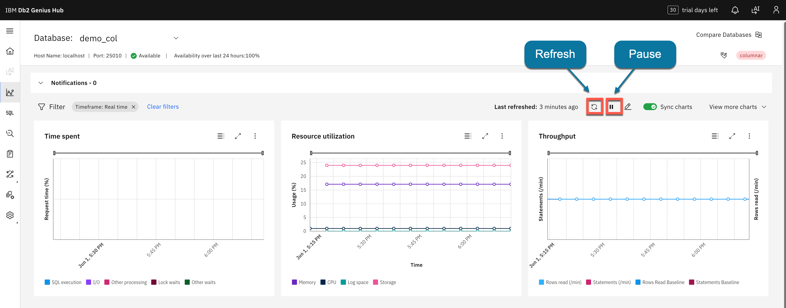
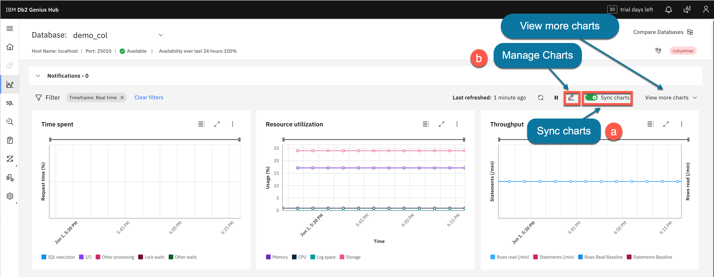
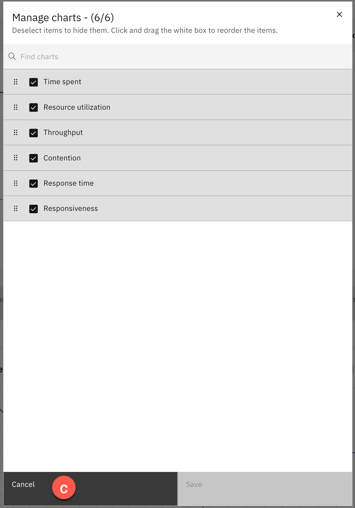
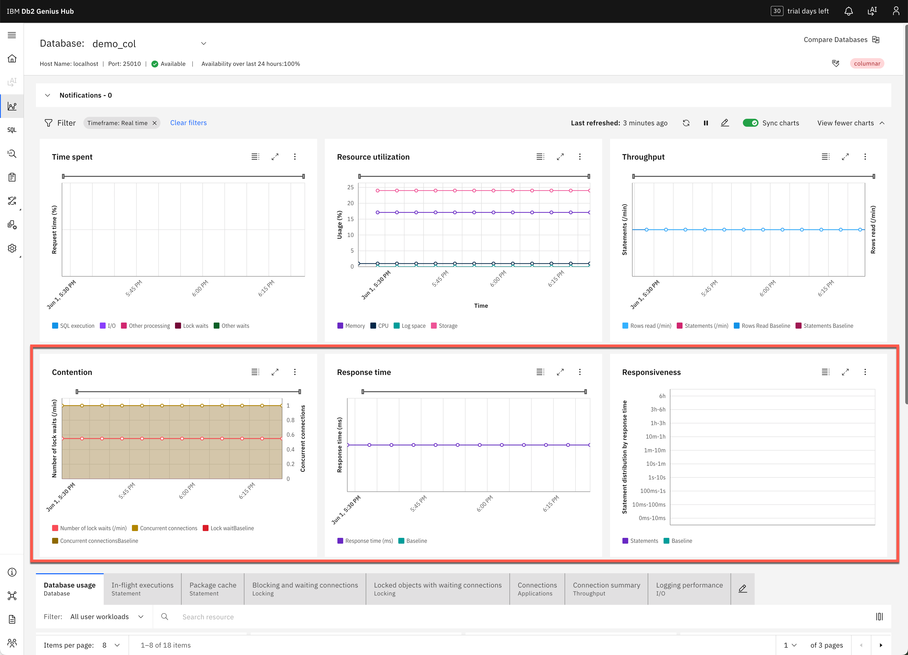

<h1 style="padding-left:16px; border-left:8px solid #378ADD;">2.4 — Monitor Dashboard</h1>

From the side menu, click **Monitor (a)**.

The Monitor dashboard shows detailed information for a specific database. Use the drop-down in the upper-right to switch between databases.

---

<h3 style="padding-left:14px; border-left:5px solid #EF9F27;">Filters</h3>

The filter bar shows **Real Time** data by default.

1. Click **Filter (a)**.

   

2. The Filter window opens. You can filter by user or application for a selected time range.

3. Click **Cancel (b)** for now.

   

---

<h3 style="padding-left:14px; border-left:5px solid #EF9F27;">Details Tabs and Manage Tabs</h3>

Each Details tab is populated with data from the selected time period.

1. There are **37 different tab options** available. Click **Manage tabs (a)** to see all options.

   

2. The most common metrics are already selected by default. Select additional metrics as needed.

3. Click **Save (b)** if you made changes, otherwise click **Cancel (a)**.

   

---

<h3 style="padding-left:14px; border-left:5px solid #EF9F27;">Refresh and Pause</h3>

The screen auto-refreshes every 2 minutes. Use these buttons to control the display:

| Button | Action |
|---|---|
| **Refresh** | Refreshes the charts immediately |
| **Pause** | Pauses the auto-refresh |

> **ℹ️ Note:** Even when paused, Db2 Genius Hub continues capturing data in the background according to the monitoring profile collection interval.

---

<h3 style="padding-left:14px; border-left:5px solid #EF9F27;">Charts</h3>

The upper section shows 3 default charts: **Time spent**, **Resource utilization**, and **Throughput**.

1. Click **Sync charts (a)** then **Manage charts (b)**.

   

   Syncing charts ensures all charts display data for the same time period.

2. Click **Cancel (c)**.

   

3. To see additional charts, click **View more charts (a)** in the upper-right.

   

4. Additional charts are displayed.

   

   > **ℹ️ Note:** The **Response time** and **Responsiveness** charts require the Statistics Event Monitor to be enabled.

---

---

**[← 2.3: Database Connections](02-03-database-connections.md)** &nbsp;&nbsp;|&nbsp;&nbsp; **[→ 2.5: AI Configuration](02-05-ai-configuration.md)**

---
