<h1 style="padding-left:16px; border-left:8px solid #378ADD;">AI Configuration and Event Monitors</h1>


To enable the Db2 Agentic AI service in Genius Hub, you need to create an organization and API key from [db2.ibm.com](https://db2.ibm.com), then configure Genius Hub to use it.

<h3 style="padding-left:14px; border-left:5px solid #EF9F27;">Create an Organization and Get Your API Key</h3>

1. Open a new browser tab and navigate to [db2.ibm.com](https://db2.ibm.com). Log in with your IBMid.

2. In the top-right corner, click the organization name *(a)* to open the menu. Click **Create organization +** *(b)*.

   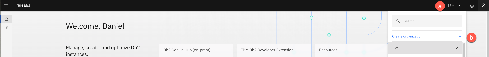

3. Enter an **Organization name** *(c)* and click **Create** *(d)*.

   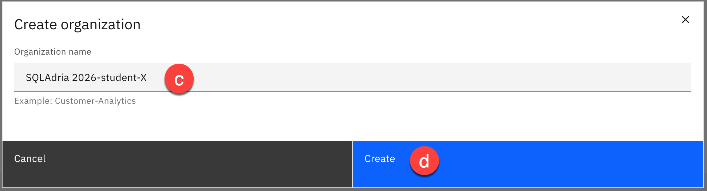

4. Click **Display API key**.

   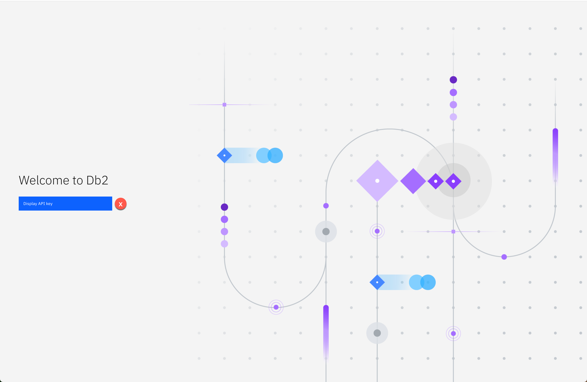

5. The **API key successfully created** dialog opens. Click **Copy** to copy the key to your clipboard, then click **Close**.

   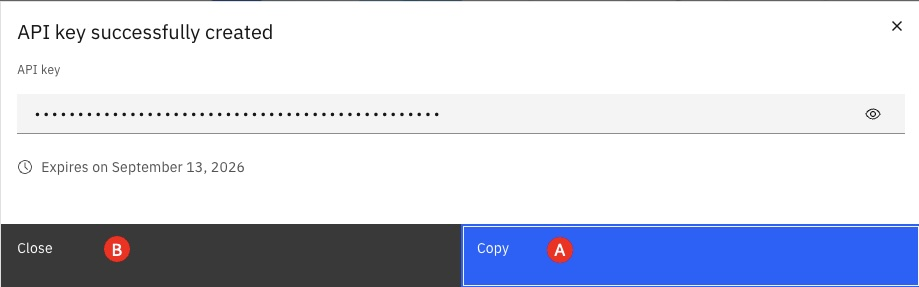

---

<h3 style="padding-left:14px; border-left:5px solid #EF9F27;">Configure AI in Genius Hub</h3>

6. Return to the **Genius Hub** browser tab. From the side menu select **Administration → Console**.

   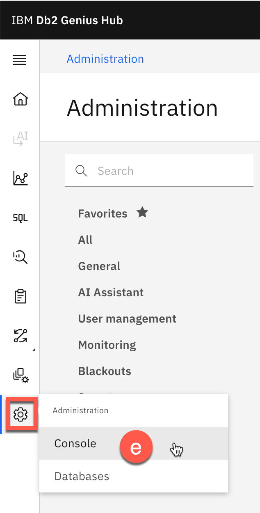

7. In the **AI Assistant** section, click **AI configuration** *(e)*.

   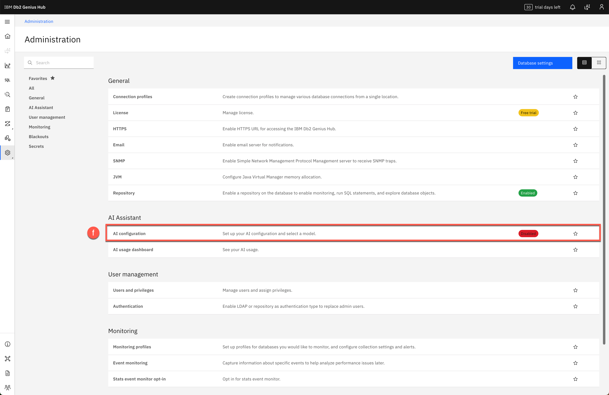

8. On the **AI configuration** page, enable **Agentic AI** by clicking the slider *(g)* from **Disabled** to **Enabled**.

   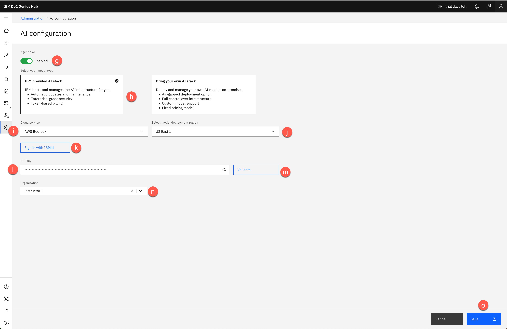

   The model type is pre-selected for this lab:

   | Label | Field | Value |
   |---|---|---|
   | **h** | Model type | IBM provided AI stack |
   | **i** | Cloud service | AWS Bedrock |
   | **j** | Model deployment region | US East 1 |

   > **ℹ️ Note:** The model is pre-selected — no changes are needed to the model type or cloud service settings.

9. Click **Sign in with IBMid (k)**. You should already be logged in from Part 1.

10. Paste the API key into the **API key field (l)** and click **Validate (m)**.

11. In the **Organization field (n)**, select the organization you just created.

12. Click **Save (o)**.

---

<h3 style="padding-left:14px; border-left:5px solid #EF9F27;">Verify the Agentic AI Service is Running</h3>

13. SSH into the VM as `db2ghadm`. See [Section 1 — Student SSH Access](01-setup.md#step-1--student-ssh-access).

14. Run `ghstatus`:

    ```bash
    ghstatus
    ```

    If the Agentic AI Service shows as `STOPPED`, start the Anomaly service:

    ```bash
    cd /home/db2ghadm/ibm-db2GeniusHub/addons/anomaly-detection
    ./start.sh
    ```

15. Confirm all services are running:

    ```bash
    ghstatus
    ```

    Expected output:

    ```
    ==========================================
    IBM Db2 Genius Hub - Product Status Check
    ==========================================

    Component Status Summary:
    ---------------------------------------------------------------------------------
    Component                 Status          Details
    ---------------------------------------------------------------------------------
    Liberty Server            RUNNING         PID: 26583   | Port(s): 11100(HTTP),11101(HTTPS)
    Agentic AI Service        RUNNING         PID: 37750   | Port(s): 11108
    Anomaly Detection Service RUNNING         PID: 38002   | Port(s): 11109
    DRS Agent Service         RUNNING         PID: 27023   | Port(s): 11096
    Job Scheduler Service     RUNNING         PID: 27090   | Port(s): 11107
    Redis Service             RUNNING         PID: 35508   | Port(s): 6379
    ---------------------------------------------------------------------------------

    Overall Status: [OK] All components are running
    ```

---

<h2 style="padding-left:14px; border-left:6px solid #1D9E75;">Modify the Monitoring Profile Collection Interval</h2>

Change the collection interval from 5 minutes to 1 minute for faster data capture during the lab.

1. From the side menu, select **Administration (a) → Console (b)**.

   

2. Click **Monitoring profiles (c)**.

   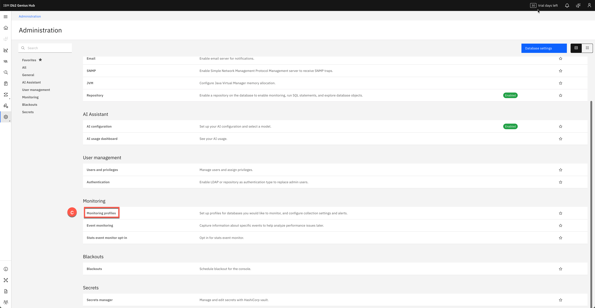

3. Click the **default (d)** profile.

   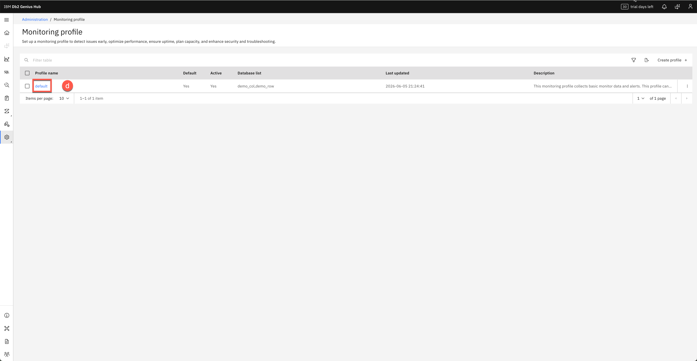

4. Click the **pencil (e)** icon to edit the profile.

   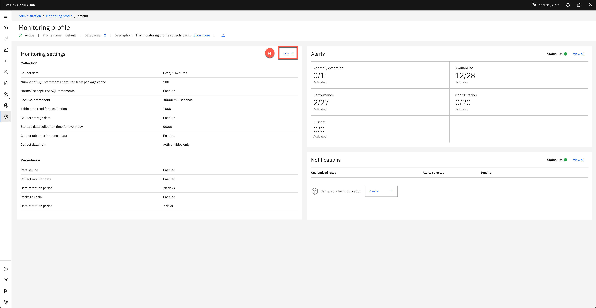

5. Change the **Collection interval** *(f)* to **1 minute**.

   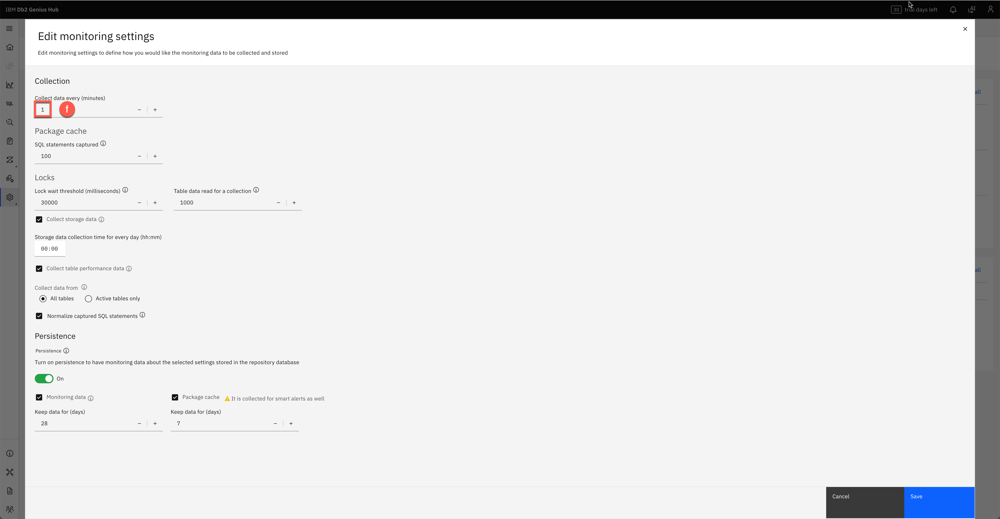

   > **ℹ️ Note:** The minimum value is 1 minute. This is done here to capture data as quickly as possible for demonstration purposes. In a production environment, you would collect data less frequently to reduce overhead.

---

<h2 style="padding-left:14px; border-left:6px solid #1D9E75;">Turning on Event Monitors</h2>

Some Db2 Genius Hub features require event monitors to capture performance data:

| Feature | Required Event Monitor |
|---|---|
| Response time / Responsiveness charts | Statistics event monitor |
| Individual Executions tab / Impact Analysis | Activity event monitor |
| Locking event monitor tab | Locking event monitor |
| Utilities event monitor tab | Utility event monitor |
| Config event monitor tab | Config event monitor |

1. From the side menu, select **Administration (a) → Console (b)**.

   

2. Under **Monitoring**, click **Event monitoring (c)**.

   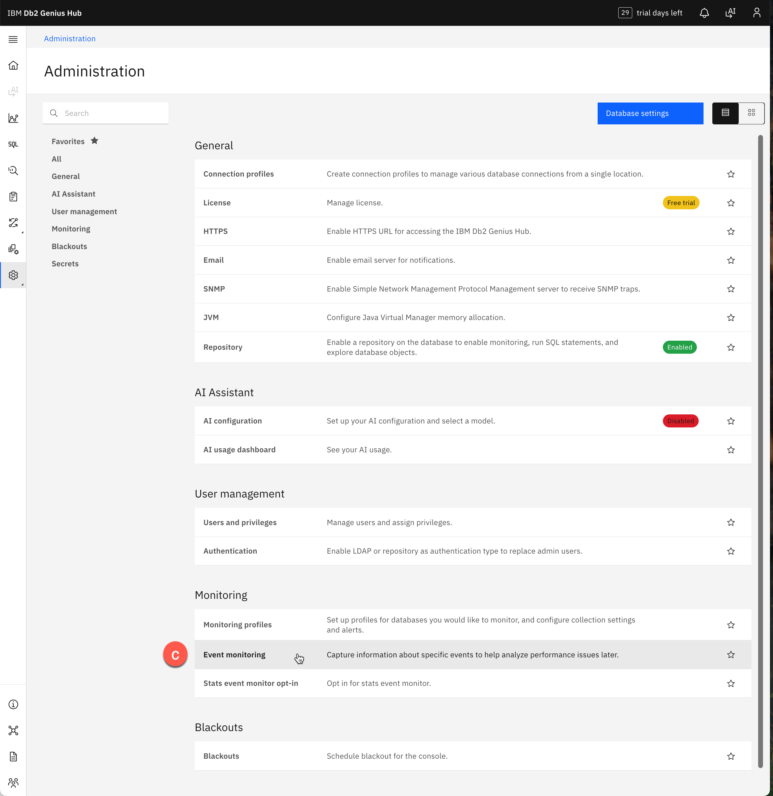

3. Expand **`demo_col`** *(d)* and click the **pencil** *(e)* icon.

   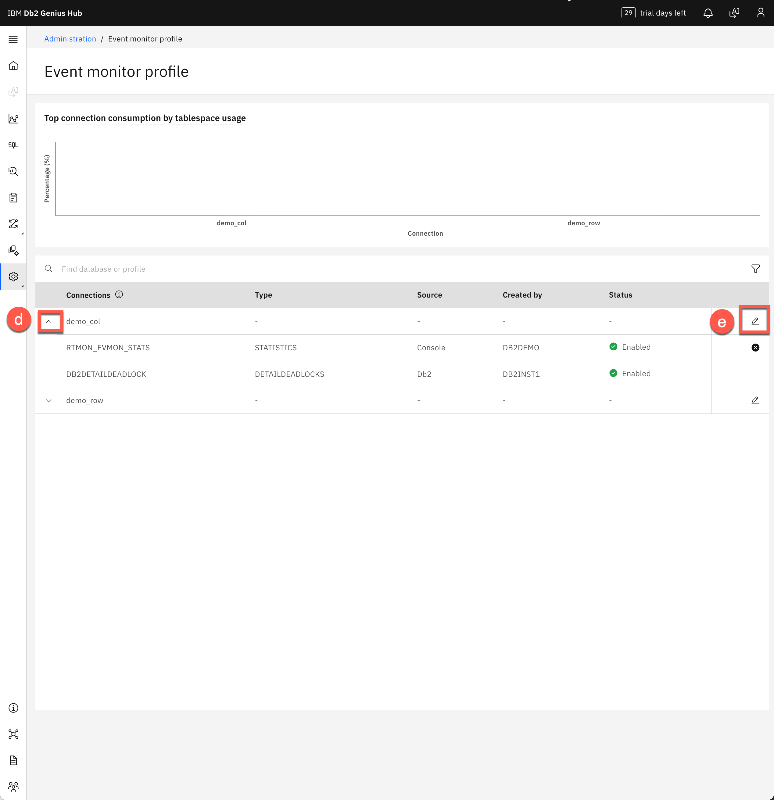

   > **ℹ️ Note:** Db2 Genius Hub requires a tablespace to create event monitor tables. A dedicated tablespace `TS4MONITOR` has already been created for this lab.

   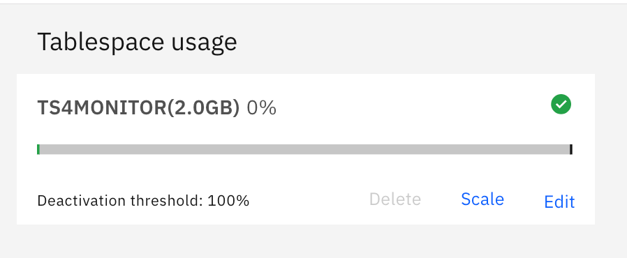

   There are 3 ways to create the event monitor tablespace (informational — do not create one for this lab):

   | Method | Description |
   |---|---|
   | **Web UI** | Use Db2 Genius Hub to create the tablespace automatically |
   | **REST API** | [Defining a tablespace by using REST API](https://www.ibm.com/docs/en/db2-genius-hub/1.1.x?topic=apis-defining-table-space-by-using-rest-api) |
   | **Manual** | [Table space prerequisites for event monitoring](https://www.ibm.com/docs/en/db2-genius-hub/1.1.x?topic=profile-table-space-other-prerequisites-event-monitoring) |

4. From the **Activity (f)** tab, enable. The options on the right side become available.

   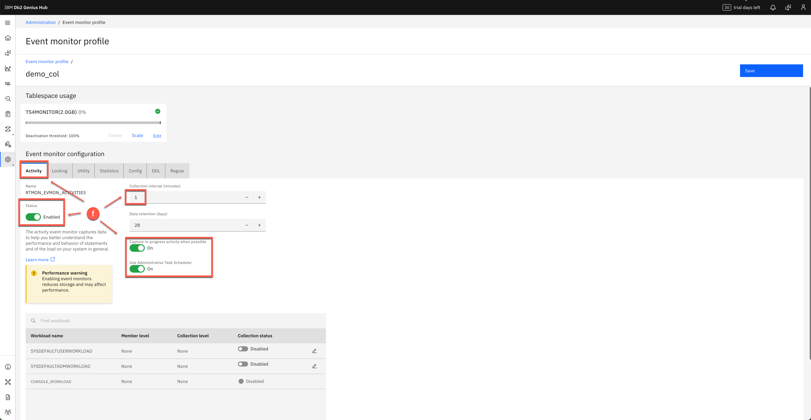

   | Setting | Default | Description |
   |---|---|---|
   | Collection interval | 1 minute | How often Genius Hub reads and processes event monitor data |
   | Data Retention | 28 days | How long data is kept in repository tables |
   | Use Administrative Task Scheduler | Optional | Enables automated watchdog process (strongly recommended) |

   ```
   db2set DB2_ATS_ENABLE=YES
   ```

   > **📖 Reference:** [Administrative Task Scheduler (ATS) in event monitoring](https://www.ibm.com/docs/en/db2-genius-hub/1.1.x?topic=profile-administrative-task-scheduler-ats-in-event-monitoring)

5. Select the **Locking (g)** tab → change status to **Enabled** → set Collection interval to **1 minute**.

   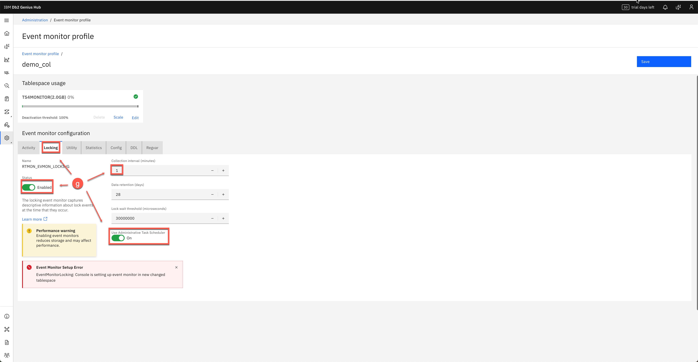

6. Select the **Utility (h)** tab → change status to **Enabled** → set Collection interval to **1 minute**.

   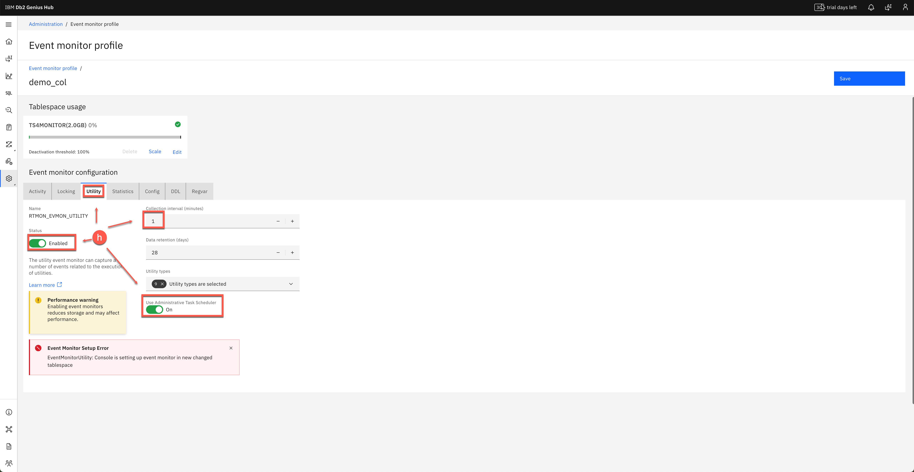

   Click the down caret to expand **Utility type** and view all collected utilities (leave all selected).

   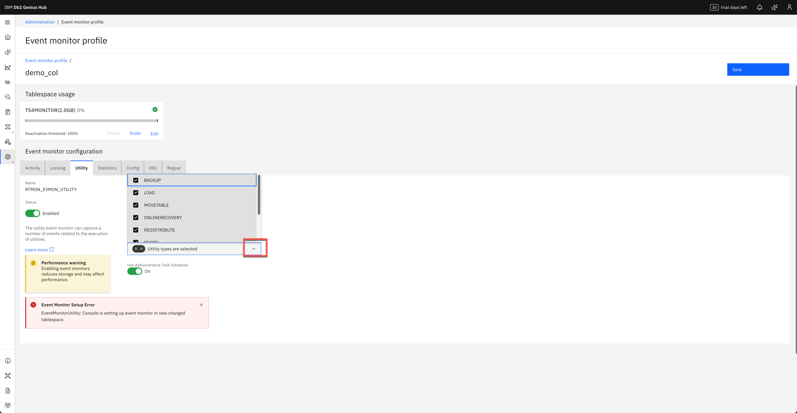

7. Select the **Statistics (i)** tab → ensure Status is **Enabled** → set Collection interval to **1 minute**.

   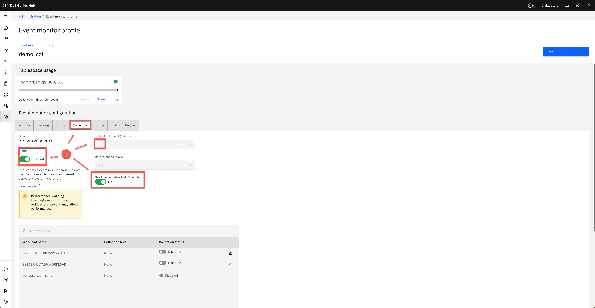

8. Select the **Config (j)** tab → change status to **Enabled** → set Collection interval to **1 minute**.

   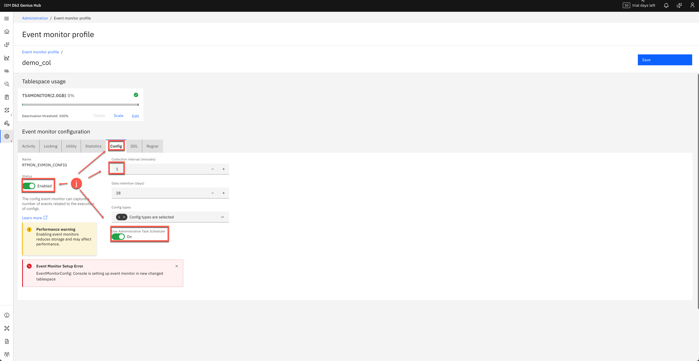

   When config event monitoring is enabled, Genius Hub creates the following in the monitored database:

   - Event monitor: `RTMON_EVMON_CONFIG`
   - Tables: `IBM_RTMON.CHG_SUMMARY_HISTORY`, `IBM_RTMON.DB_DBM_HISTORY`
   - Stored procedure: `IBM_RTMON.RTMON_EVMON_CONFIG_WATCHDOG`
   - Db2 ATS task: **Rtmon Evmon Config Watchdog**

9. Select the **Config types (k)** down caret to view which Db2 configuration parameters to track (leave all selected).

   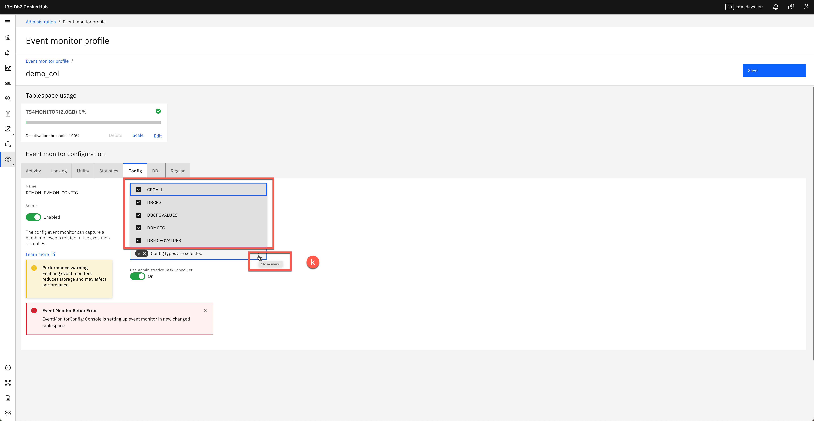

10. Select the **DDL (l)** tab → ensure Status is **Disabled**.

    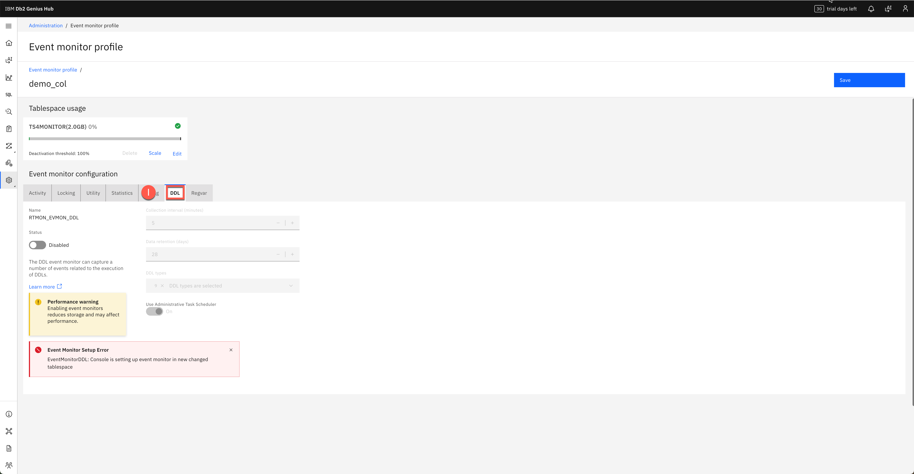

11. Select the **Regvar (m)** tab → change status to **Enabled** → set Collection interval to **1 minute**.

    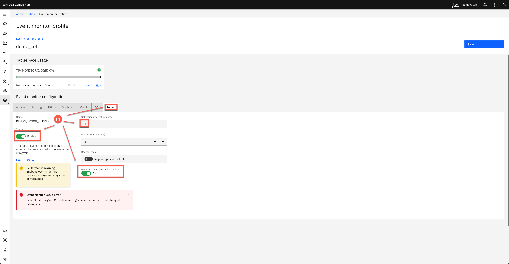

12. Click **Save (n)** in the upper-right.

    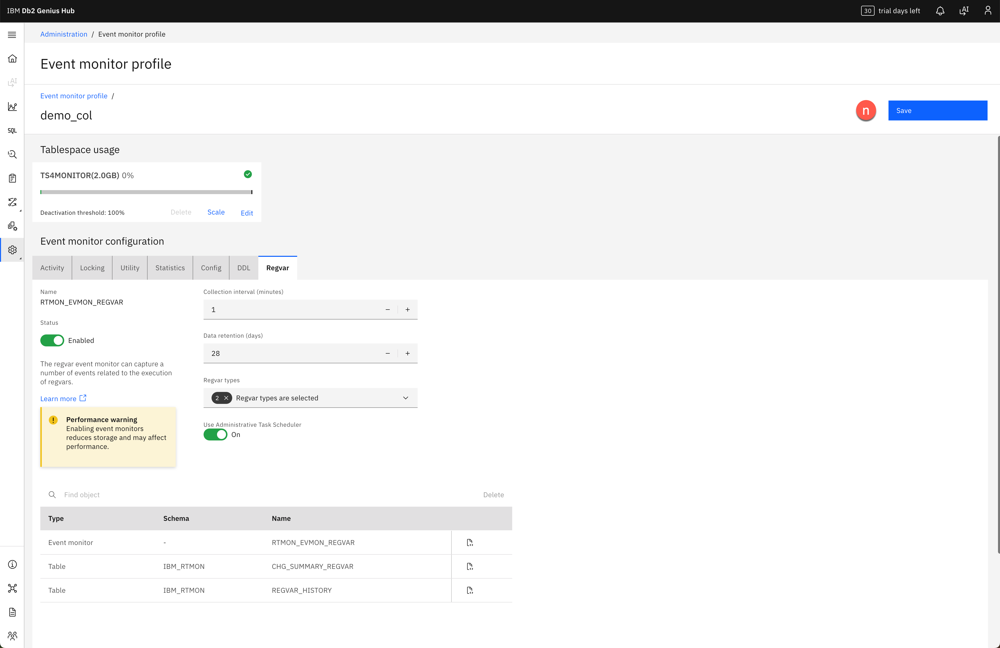

    You will see a confirmation message at the top of the screen:

    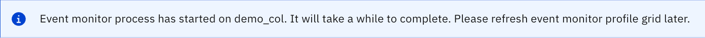

13. After a few minutes, the event monitors should appear in the screen. Refresh the page as needed.

    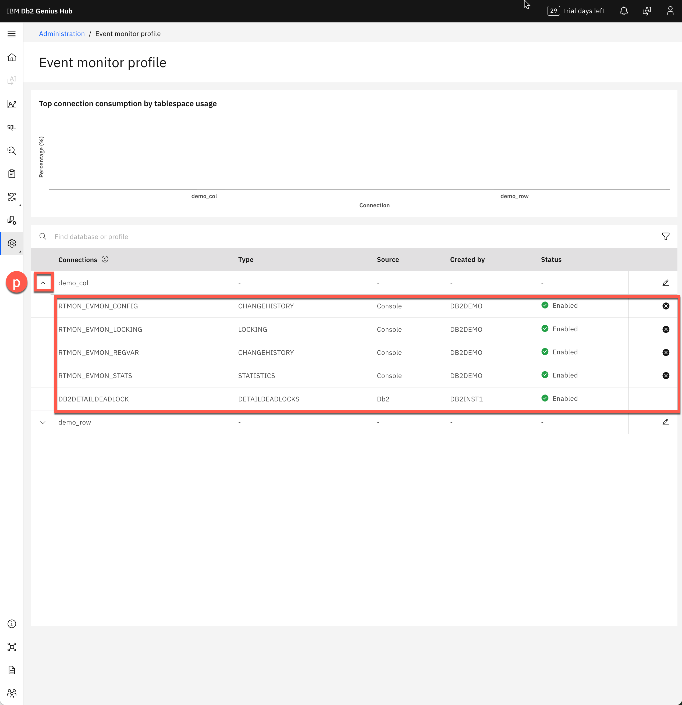

14. From the side menu, select **Monitor (a)**.

    

15. Click **View more charts (b)**. The **Contention**, **Response time**, and **Responsiveness** graphs are now visible.

    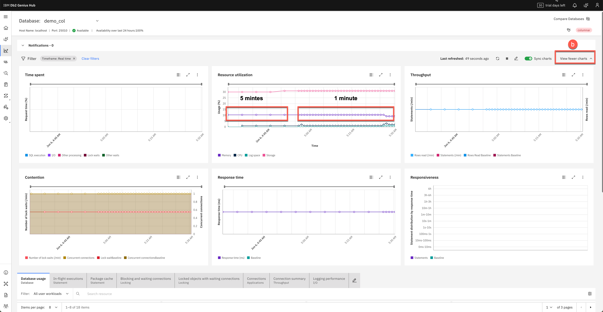

    > **ℹ️ Note:** Charts won't show meaningful data yet — no workload is currently running. In the Agentic AI Simulator section, workload will run so you can explore the charts with real data.

---

> **📖 Reference: How Event Monitors Work in Db2 Genius Hub**
>
> The Administrative Task Scheduler (ATS) is not required, but is strongly recommended.
>
> **Without ATS:** If Genius Hub loses its connection to a monitored database, the event monitor cycle is broken and event monitor tables will continue to grow unmanaged.
>
> **With ATS:** A watchdog process automatically detects and drops lost/orphaned event monitors.
>
> **The event monitor cycle:**
>
> 1. Genius Hub issues: `CREATE EVENT MONITOR ... WRITE TO TABLES`
> 2. Db2 creates the event monitor and its associated tables.
> 3. Db2 inserts performance data into the event monitor tables.
> 4. Genius Hub reads the data, populates the repository tables, then flushes the event monitor.
> 5. Repeat from step 3.
>
> If the connection is lost, Db2 continues inserting data but the flush step never runs — tables grow until the tablespace fills. ATS prevents this by automatically cleaning up orphaned monitors.

---

<h2 style="padding-left:14px; border-left:6px solid #1D9E75;">Configure Tabs for Utilities Monitoring</h2>

Before starting the data load, add the **Utilities** and **Utilities event monitor** tabs to the Monitor dashboard so you can observe load activity in real time.

1. From the Monitor dashboard, click the **edit tabs** icon on the right side of the tab bar.

   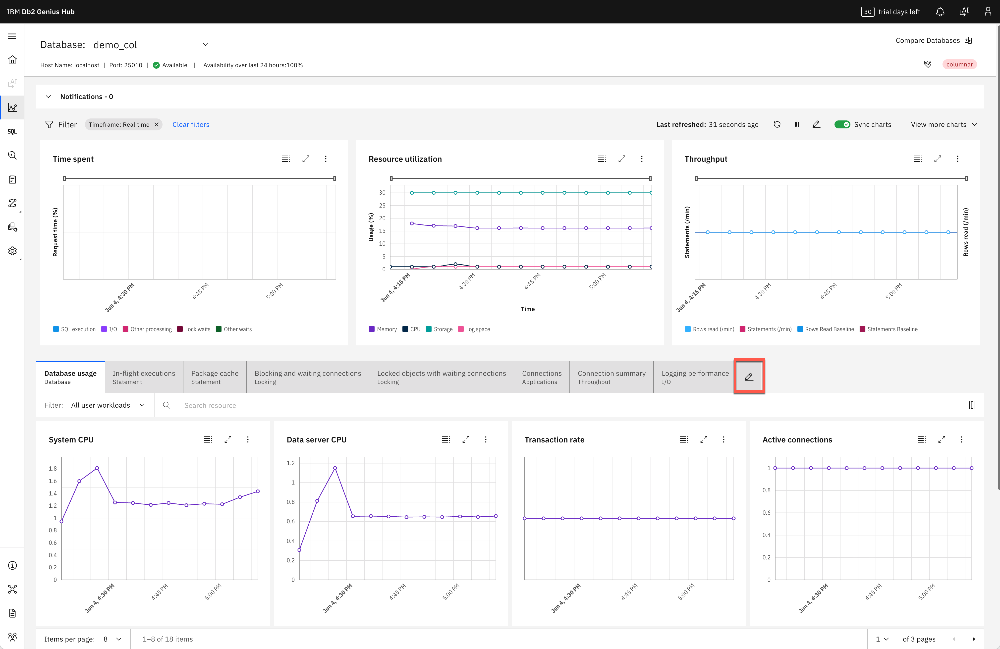

2. The **Manage Tabs** window opens. Under **Applications**, select **Utilities** and **Utilities event monitor (a)**.

   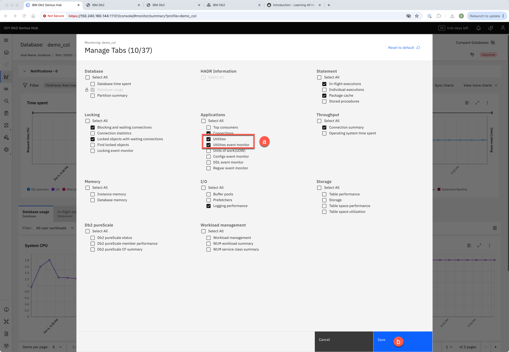

3. Click **Save (b)**.

---

---

**[← Monitor Dashboard](02-04-monitor-dashboard.md)** &nbsp;&nbsp;|&nbsp;&nbsp; **[→ SQL Editor](03-01-sql-editor.md)**

---
