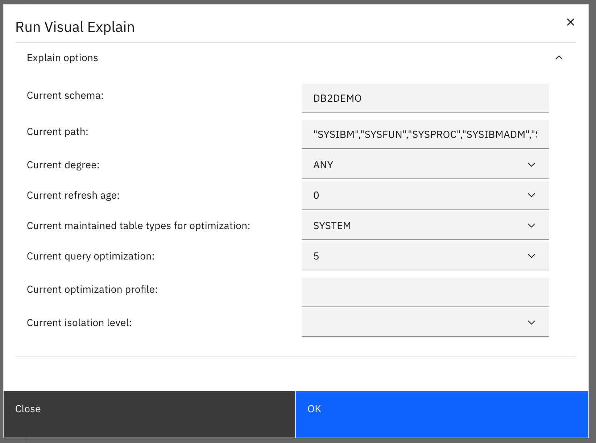

<h1 style="padding-left:16px; border-left:8px solid #378ADD;">Query Tuning</h1>

1. From the Visual Explain results, click **Tune query (a)** at the lower-right side of the screen.

   

2. The **Select tuning activities to run** window opens. Enter a **Name (a)** you can easily identify and click **OK (b)**.

   

3. The information window opens. Click **Close (a)**.

   

4. Go back to the Workbench and click **Query tuning log (a)**.

   

5. Select **your query tuning task (a)** and click **View result (b)**.

   

6. The tuning results window opens. Click **Report (a)** and scroll down to the **Recommended DDL for indexes (b)**.

   

7. Go back to the **Advisor recommendation (a)** tab and select **Indexes (b)**. Select the index for `MYTABLE`.

   

8. From **Advisor scripts**, select **On-demand (a)** and click **Run (b)**.

   

9. The **Create on-demand tuning task** window opens. Change the tuning task name *(a)* to something identifiable and click **Next (b)**.

   

10. Review the summary page and click **Finish (a)**.

    

11. A message confirms the task was created successfully. Click **Tuning results (a)**.

    

12. Click **Tuning results** to see the list of tasks.

    

13. Select the index task to review the results.

    

14. The **View result** window opens. Click **Close (a)**.

    

    Now that statistics are updated, retune the query to check for index recommendations.

15. Select your single-query tuning task and click **Retune**.

    

16. Enter a **Name (a)** and click **OK (b)**.

    

17. Click **Close (a)**.

    

18. Select your **retune task (a)** and click **View result (b)**.

    

19. This time, there are no recommendations — the query is already optimized.

    

20. Return to the tab with the tuned query (a). Select the query where `CODE = 2512` (b) and click **Explains the statement (c)***.

    

21. Review the **Run Visual Explain Options** and click **OK (a)**.  

    

22. Review the explain — the index is now being used.

    **With Index:**

    

23. Compare to the original explain before the index was applied.

    **Without Index:**

    

---

<h2 style="padding-left:14px; border-left:6px solid #1D9E75;">Query Plan Comparison</h2>

The tables below compare the two execution plans — with and without the index applied.

| Aspect | With Index (Plan 1) | Without Index (Plan 2) |
|---|---|---|
| **Operator chain** | Return → Ixscan → Table | Return → Tq → Tbscan → Table |
| **Scan type** | **Index scan (Ixscan)** | **Table scan (Tbscan)** |
| **Cumulative total cost** | −0.00 | 7.07 |
| **Cumulative CPU cost** | 48,530 | 271,833 |
| **Cumulative I/O cost** | 0.00 | 1.00 |
| **Estimated output cardinality** | 2.00 rows | 1.00 row |
| **Extra operator** | None | Tq (table queue — parallel) |
| **PLANID** | `ff1f9de6295fb22` | `13c96b740a9173f8` |

> The index reduced CPU cost from **271,833** to **48,530** — an **82% improvement**.

---

<h2 style="padding-left:14px; border-left:6px solid #1D9E75;">Impact Analysis *(Coming Soon)*</h2>

> **📌 Placeholder:** This section is reserved for future lab tasks.

The Impact Analysis report shows how the recommended index will affect the performance of your existing queries — which queries will gain performance and which may be impacted if the index is applied.

---

<h2 style="padding-left:14px; border-left:6px solid #1D9E75;">Query Workload *(Coming Soon)*</h2>

> **📌 Placeholder:** This section is reserved for future lab tasks.

The Query Workload feature tunes several queries simultaneously and recommends indexes based on the overall workload — not just a single query.

---

---

**[← Visual Explain](03-02-visual-explain.md)** &nbsp;&nbsp;|&nbsp;&nbsp; **[→ Drill-Down Investigation](04-01-drill-down.md)**

---
