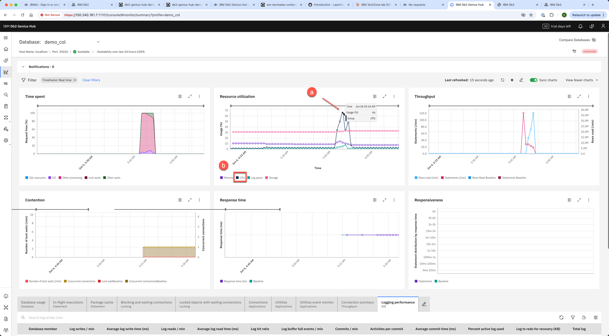
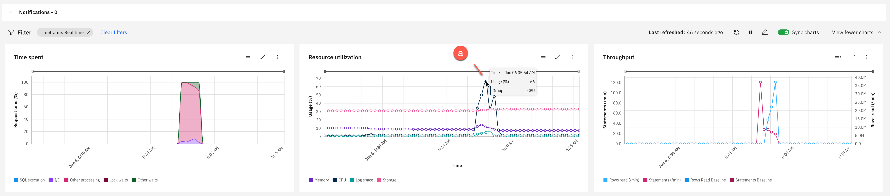
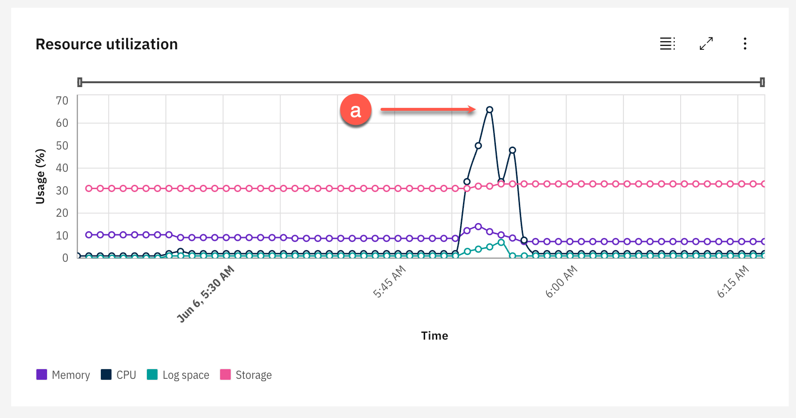
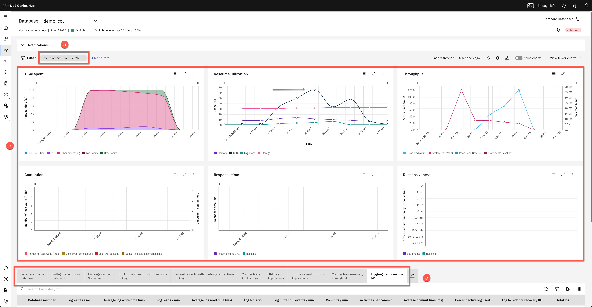
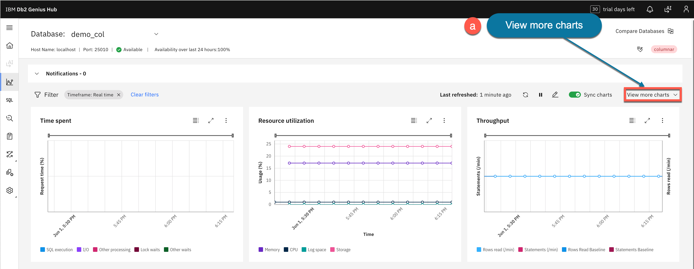
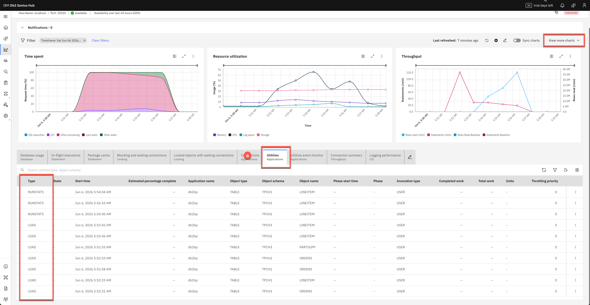
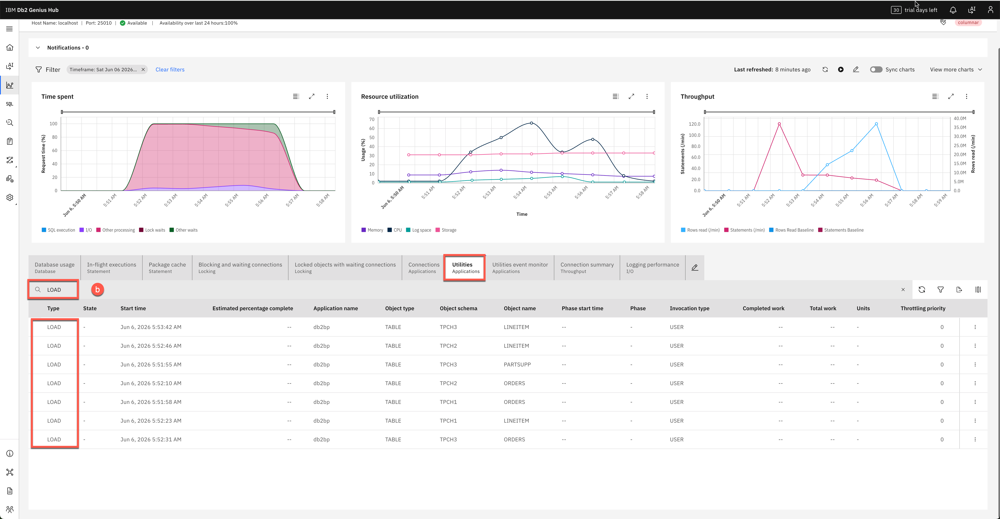
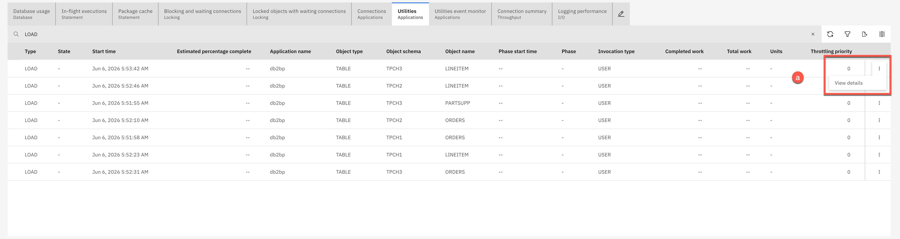
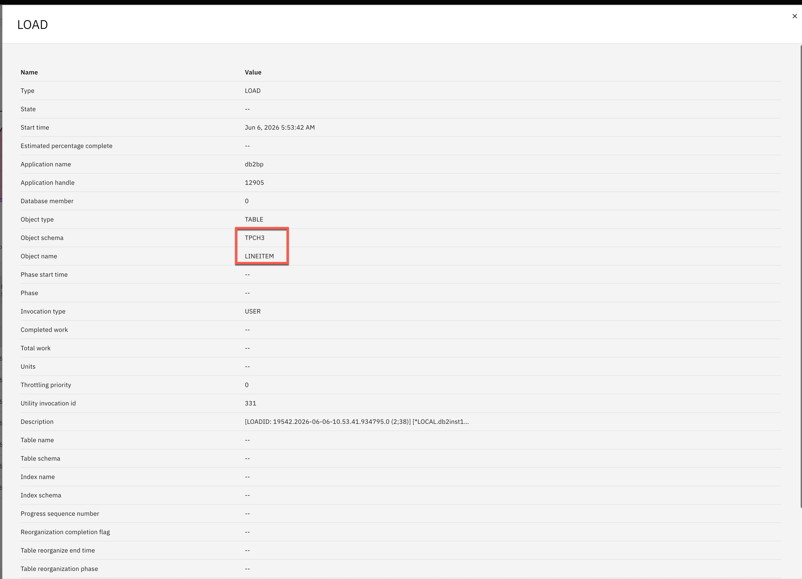

<h1 style="padding-left:16px; border-left:8px solid #378ADD;">4.1 — Drill-Down Investigation</h1>

<h1 style="padding-left:16px; border-left:8px solid #378ADD;">Section 4 — Monitoring Databases</h1>

Now that you have learned the basics, let's start monitoring databases.

> **⚠️ Prerequisite:** Event monitors were configured in [Section 2 — Turning on Event Monitors](02-basics.md#turning-on-event-monitors). If you skipped that section, complete it before proceeding.

> **ℹ️ Pre-created TPC-H schemas:** Three schemas are pre-created in the `demo_col` database with empty tables, ready for data loading:
>
> | Schema | Dataset Size |
> |---|---|
> | `tpch1` | 1 GB |
> | `tpch2` | 2 GB |
> | `tpch3` | 3 GB |

---

<h2 style="padding-left:14px; border-left:6px solid #1D9E75;">Start the Data Load</h2>

1. SSH into the VM as `db2demo`. See [Section 1 — Student SSH Access](01-setup.md#step-1--student-ssh-access) for instructions.

2. Start the data load script:

   ```bash
   ./load-tpch-data.sh
   ```

   > **ℹ️ Note:** The script loads data into the `tpch1`, `tpch2`, and `tpch3` schemas in parallel. This generates heavy workload that you will observe in the Monitor dashboard.

   Example output:

   ```
   ========================================
   TPCH Data Loading Script
   ========================================

   ✓ All data directories found

   Data File Sizes:
   1.1G    /data/tpch1
   2.1G    /data/tpch2
   3.0G    /data/tpch3

   ========================================
   Starting Parallel Data Loading
   ========================================

   🔥 This will create HEAVY database activity!
   🔍 Open Db2 Genius Hub NOW to monitor:
      https://150.240.161.7:11101/console

   Loading will take 20-30 minutes...

   Starting TPCH1 load (1 GB)...
   Starting TPCH2 load (2 GB)...
   Starting TPCH3 load (3 GB)...

   ✓ All three loads started in parallel!
   ```

3. Open the Monitor dashboard. From the side menu, click **Monitor (c)**.

   

   > **ℹ️ Note:** You may receive a **Virtual memory in use** notification while the load is running. This is expected in the lab environment where Db2 and the Genius Hub repository share the same VM. In production, it is recommended to run Genius Hub on a separate, properly sized server.

4. Analyze the graphs and check for anomalies or spikes **(a)** in CPU usage **(b)**. As data loads, you will see system resources increase.

   

   In the example below, something happened around **June 6 5:54 AM** where the graph shows an anomaly. **Write down the time of your anomaly** — you will investigate it in the next steps.

5. Hover over the dot **(a)** on top of the graph (do not click yet) to see the details.

   

   Around that time, CPU usage went up to **66%** compared to the average.

---

<h2 style="padding-left:14px; border-left:6px solid #1D9E75;">Using Drill-Down for Investigation</h2>

1. Click the small dot **(a)** to drill down for more details.

   

2. Genius Hub sets the filter **(a)** to the time of the issue. All graphs **(b)** and tabs **(c)** now reflect the CPU data according to the filter.

   

<h3 style="padding-left:14px; border-left:5px solid #EF9F27;">Checking the Utilities</h3>

3. Click **View more charts (a)** to collapse extra charts.

   

4. Click the **Utilities Applications (a)** tab to see the top utilities running at the time of the anomaly.

   

5. In the Search bar, type `LOAD` and press **Enter** to filter to LOAD type only.

   

6. Click the three vertical dots **(a)** to the right of one of the LOAD utilities and select **View details**.

   

   

   The Utilities tab shows multiple LOAD utilities running simultaneously at the time of the CPU spike — loading data into tables such as `TPCH3.LINEITEM`. Db2 Genius Hub has identified the parallel data load as the root cause of the increased CPU usage.

> **💡 Explore:** There are many more views and filters available in Db2 Genius Hub. Explore the different views and filters to find the information you need.

---

---

**[← 3.3: Query Tuning](03-03-query-tuning.md)** &nbsp;&nbsp;|&nbsp;&nbsp; **[→ 4.2: Reports](04-02-reports.md)**

---
