<h1 style="padding-left:16px; border-left:8px solid #378ADD;">Alerts and Jobs</h1>


Now that you have identified an anomaly, configure alerts so you are notified if it recurs.

1. From the side menu, select **Administration (a) → Console (b)**.

   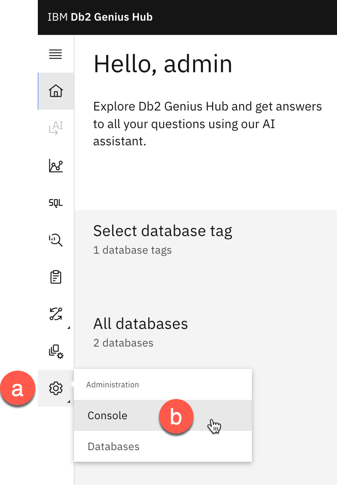

2. Under **Monitoring**, click **Monitoring profiles (c)**.

   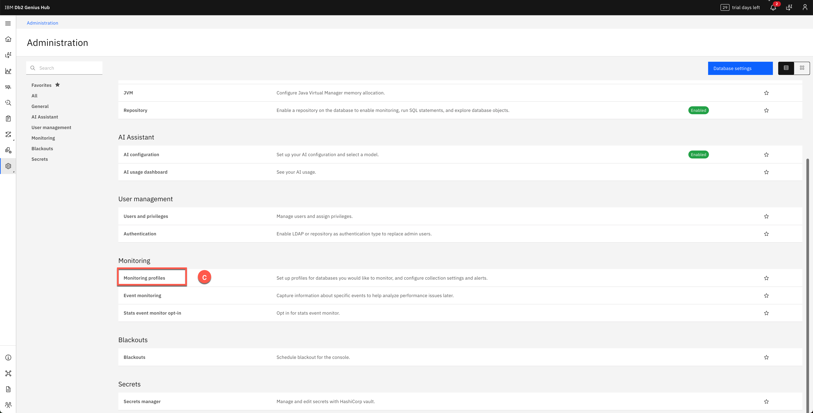

3. Select the **default (d)** profile and click **Edit (e)**.

   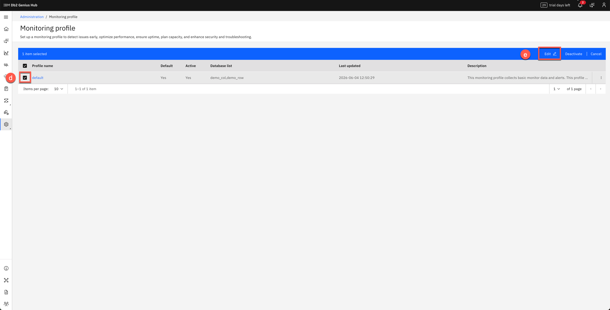

4. From the **Alerts (f)** section, click **View all (g)**.

   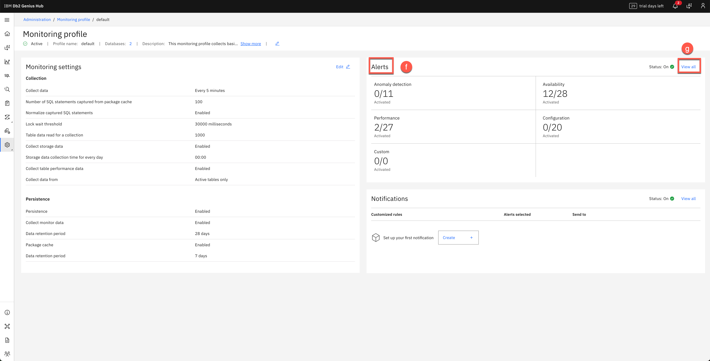

5. From the **Anomaly detection (h)** tab, select all Anomaly types and click **Activate (i)**.

   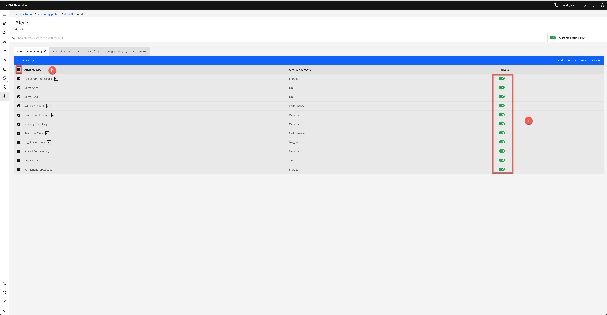

6. SSH into the VM as `db2demo` and rerun the data load script:

   ```bash
   ./load-tpch-data.sh
   ```

7. Open the Monitor dashboard. From the side menu, click **Monitor (c)**.

   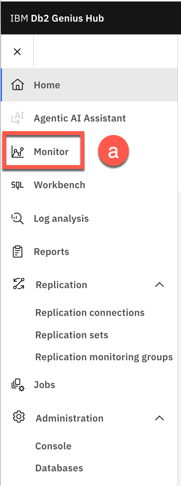

8. In the Notification section, notice the anomaly alerts.

   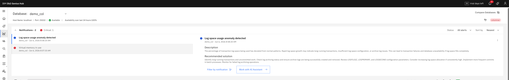

   The **Notification Center** displays active alerts. Each notification includes:

   | Element | Description |
   |---|---|
   | **Description** | What was detected and why it may be a concern |
   | **Recommended solution** | Specific actions to investigate and resolve the issue |
   | **Filter by notification** | Filters the Monitor dashboard to the time of the alert |
   | **Work with AI Assistant** | Opens the Agentic AI Assistant pre-loaded with the alert context |

9. For the **Log space usage anomaly detected** notification, click **Filter by notification (a)**.

   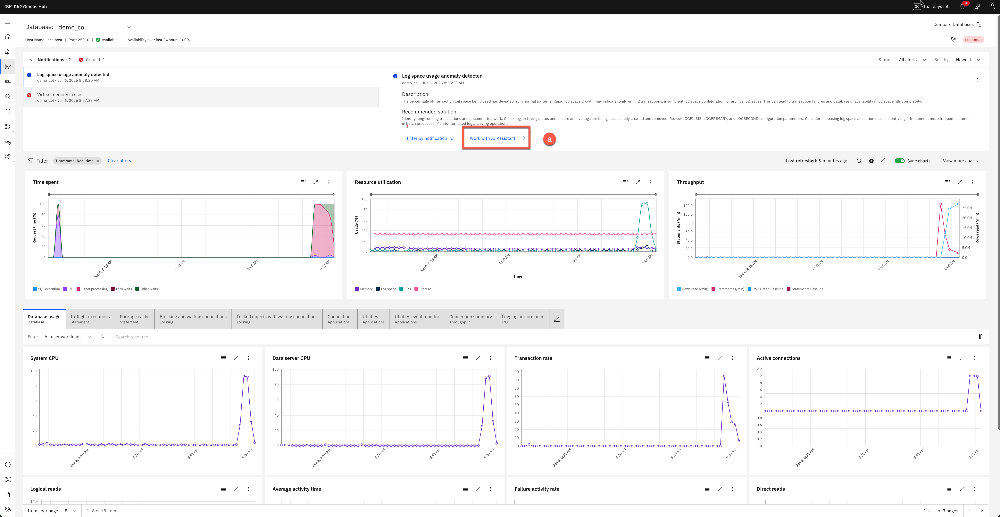

   > **ℹ️ Note:** Clicking **Filter by notification** automatically sets the time filter to the moment the anomaly was detected. All charts and tabs immediately update to show what was happening at that time.

10. For the same notification, click **Work with AI Assistant (a)**.

    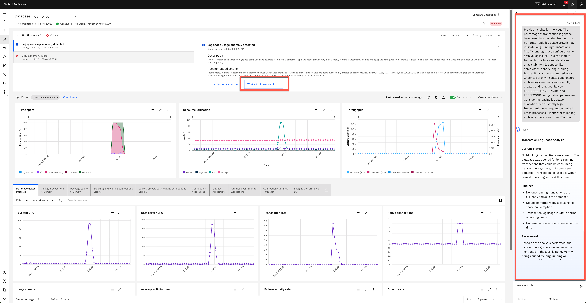

    > **ℹ️ Note:** The Agentic AI Assistant opens pre-loaded with the alert context — including the alert type, database, and time — allowing you to immediately ask follow-up questions without re-entering any context.

---

<h2 style="padding-left:14px; border-left:6px solid #1D9E75;">Query Monitoring</h2>

1. SSH into the VM as `db2demo` and run the workload exerciser script:

   ```bash
   cd /home/db2demo/db2-tpch-cli-sim/scripts
   sh ./exerciser.sh demo_col --schema1 TPCH1 --schema2 TPCH2 --schema3 TPCH3
   ```

   Expected output:

   ```
   --------------------------------------------------------------------------------
   DB2 TPC-H Workload Exerciser
   --------------------------------------------------------------------------------

   Database: demo_col
   Schemas: TPCH1, TPCH2, TPCH3

   Launching workload sessions...

   ==========================================
   All 9 workload sessions are now running!
   ==========================================

   Sessions with maintenance tasks (marked X):
   - demo_col/TPCH1/user1  (backup, reorg, runstats)
   - demo_col/TPCH2/user2  (backup, reorg, runstats)
   - demo_col/TPCH3/user3  (backup, reorg, runstats)

   This script will run until you press Ctrl+C
   ==========================================
   ```

2. Open the Monitor dashboard. From the side menu, click **Monitor (a)**.

   

3. Select `demo_col` from the **Database** drop-down list.

   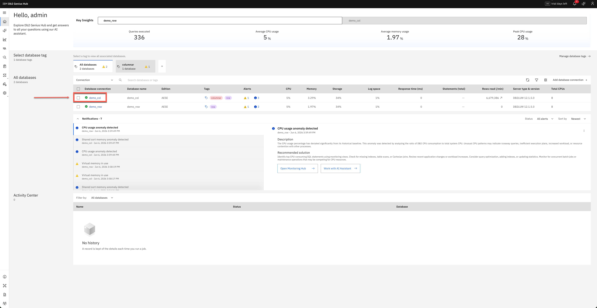

4. Allow the workload to run for approximately **5 minutes** so Genius Hub captures meaningful activity data.

5. Return to the terminal and stop the script: press **Ctrl+C**.

6. Back in Db2 Genius Hub, observe the increased resource usage on the **Resource utilization** chart.

   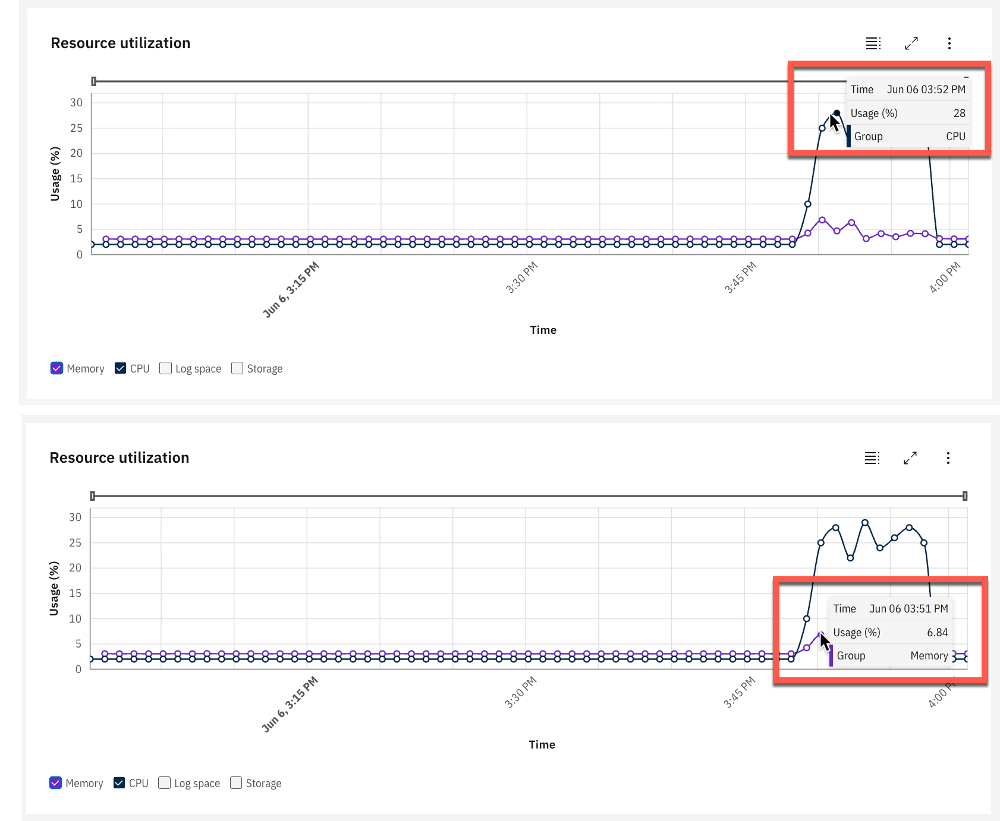

7. Click the highest CPU usage point to drill down and view the SQL statements running at that specific point in time.

   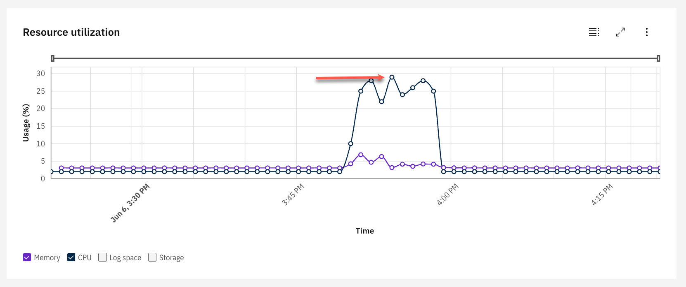

8. Notice how filtering is applied, showing only the SQL statements running at that point in time.

   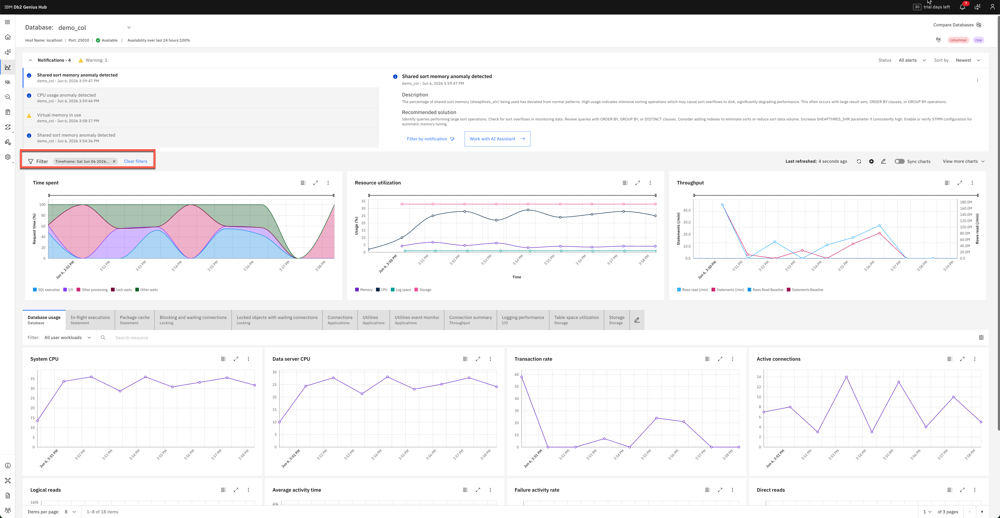

9. Click the **In-flight executions Statement** tab to view actively executing SQL at the time of the CPU increase.

   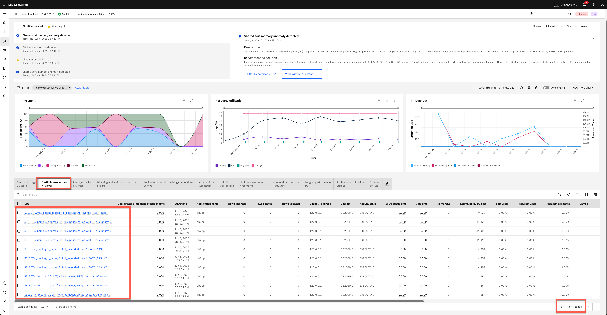

   **Key metrics available for each in-flight statement:**

   | Column | Description |
   |---|---|
   | **SQL** | The SQL statement being executed |
   | **Statement execution time** | How long the statement has been running |
   | **Start time** | When the statement started |
   | **Rows read** | Number of rows scanned |
   | **Estimated query cost** | Optimizer's estimated cost |
   | **Peak sort used** | Peak sort memory consumed |
   | **WLM queue time** | Time spent waiting in the workload manager queue |

10. Select the **Shared sort memory anomaly detected (a)** from the Notifications section.

    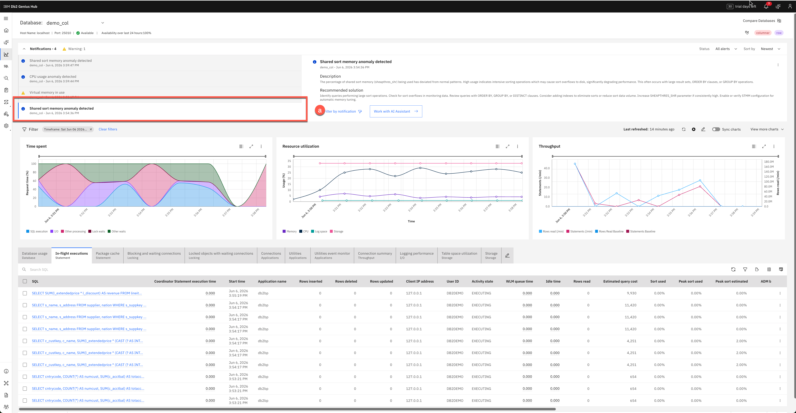

11. Click the **Filter by notification button (c)** for the **Shared sort memory anomaly detected**.

    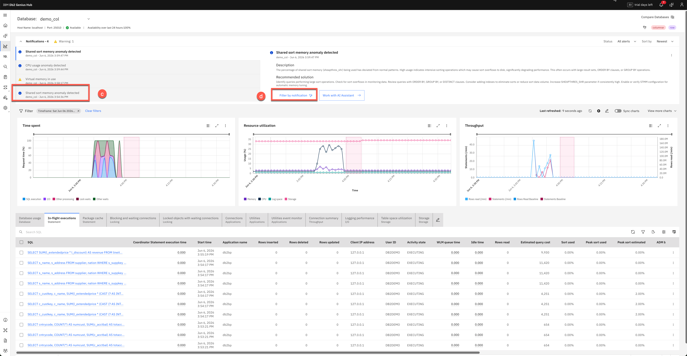

    The pink highlighted region indicates the period when the workload was actively running. The charts clearly show:

    | Chart | What You'll See |
    |---|---|
    | **Time spent** | Two distinct spikes of SQL execution activity |
    | **Resource utilization** | CPU rises sharply then returns to baseline; memory remains elevated |
    | **Throughput** | Bursts of statement execution during the active workload period |

12. Select the three vertical dots *(a)* to the right of one of the SQL statements and select **Details (b)**.

    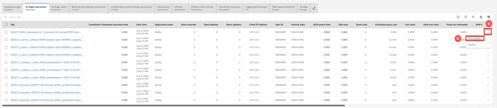

13. The **SQL details** page provides a full breakdown of the selected statement's execution context.

    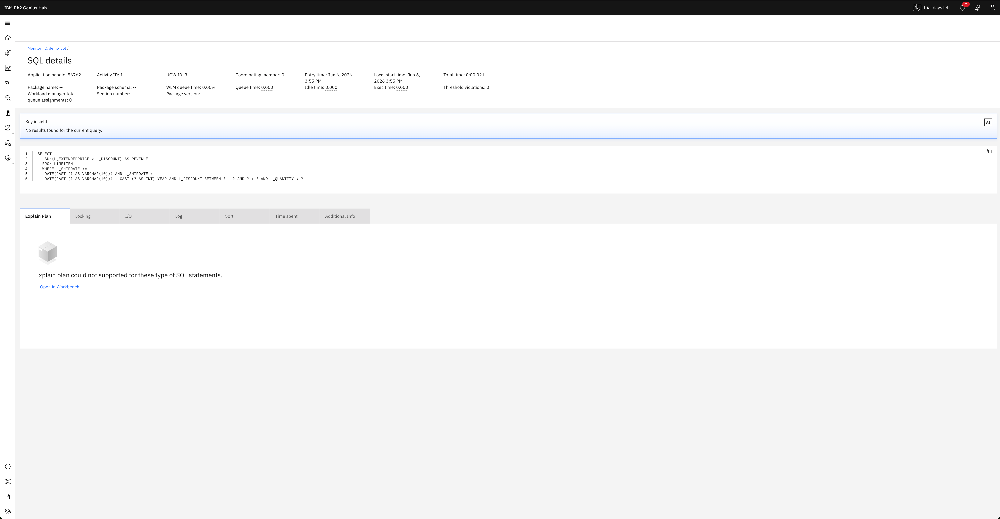

    **Execution metadata:**

    | Field | Value |
    |---|---|
    | Application handle | 56762 |
    | Activity ID | 1 |
    | UOW ID | 3 |
    | Entry time | Jun 6, 2026 3:55 PM |
    | Total time | 0:00.021 |
    | WLM queue time | 0.00% |
    | Threshold violations | 0 |

    **Analysis tabs:**

    | Tab | Description |
    |---|---|
    | **Explain Plan** | Visual execution plan for the statement |
    | **Locking** | Lock activity associated with the statement |
    | **I/O** | I/O activity during execution |
    | **Log** | Transaction log usage |
    | **Sort** | Sort memory consumption |
    | **Time spent** | Breakdown of time across execution phases |
    | **Additional Info** | Extended execution metadata |

14. Click the **Sort** tab to view sort memory details.

    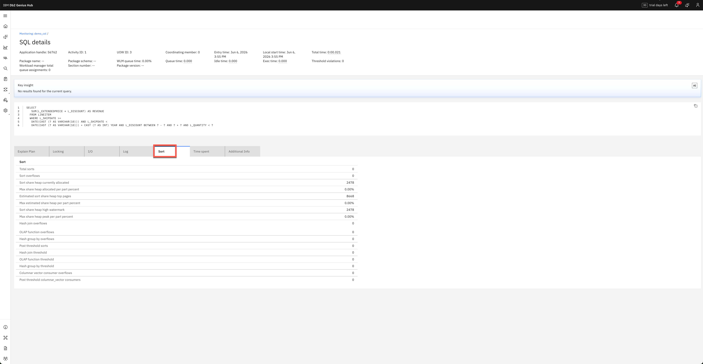

    | Metric | Value |
    |---|---|
    | Total sorts | 0 |
    | Sort overflows | 0 |
    | Sort share heap currently allocated | 2478 |
    | Estimated sort share heap top pages | 8668 |
    | Sort share heap high watermark | 2478 |
    | Hash join overflows | 0 |
    | Hash group by overflows | 0 |

    > **ℹ️ Note:** Even though this individual statement shows no sort overflows, the sort share heap allocation (2478 pages, estimated top 8668) is significant. When many similar TPC-H queries run concurrently, the cumulative sort heap usage across all statements triggers the shared sort memory anomaly.

15. Click the **Explain Plan (a)** tab, then click **Open in Workbench (b)**.

    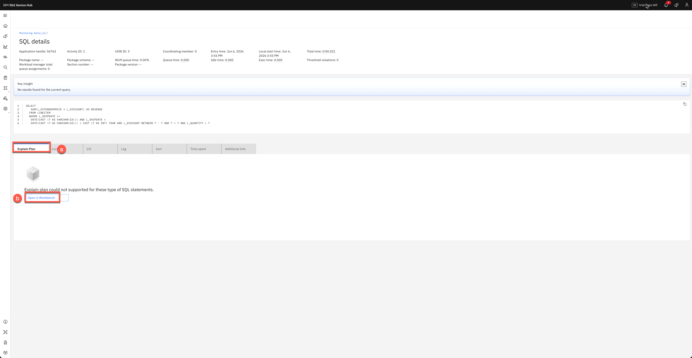

16. On the Workbench, click the **Explain (a)** icon.

    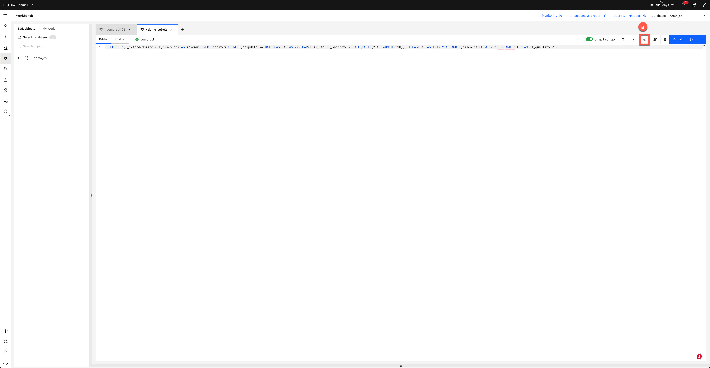

17. Click **OK** to run the visual explain.

    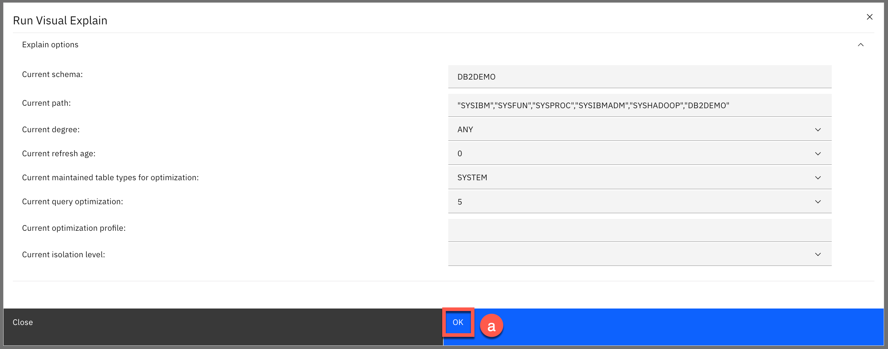

18. Change the schema to `TPCH3` and click **OK (b)** to generate the explain.

    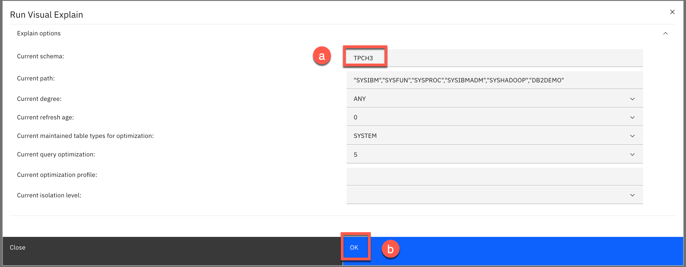

19. Review the visual explain plan.

    

    **Execution plan breakdown:**

    | Step | Operator | Cost |
    |---|---|---|
    | 1 | Return | 9,570.68 |
    | 2 | Grpby (Group By) | 9,570.68 |
    | 3 | Grpby (Group By) | 9,570.68 |
    | 4 | Tbscan (Table Scan) | 9,570.64 |
    | S1 | LineItem — Tpch3 | — |

    **Properties for the selected node:**

    | Property | Value |
    |---|---|
    | Cumulative total cost | 9,570.68 |
    | Cumulative CPU cost | 15,917,137,920.00 |
    | Cumulative I/O cost | 4,185.00 |
    | Prep time | 19 milliseconds |
    | Statement heap size | 16,384 |

    The plan shows a full **table scan** on `TPCH3.LINEITEM` — confirming no suitable index exists for this query.

20. Click **Tune query** to open the AI Query Tuner.

    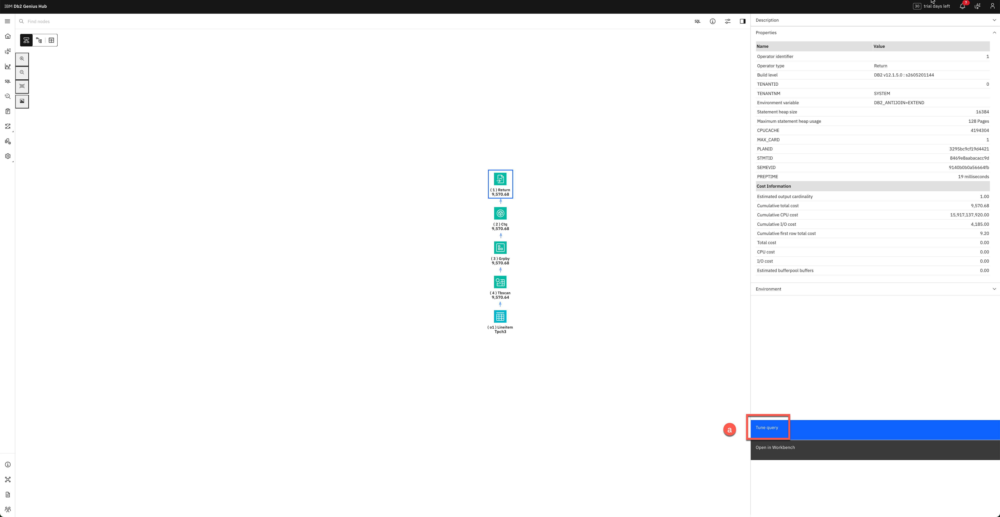

21. Click **OK** on the **Select tuning activity to run** dialog.

    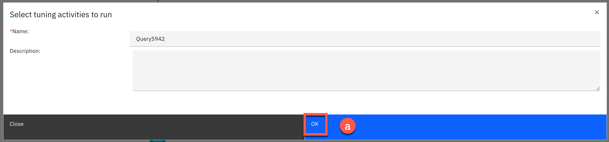

22. Click **Close** for the query tuning task.

    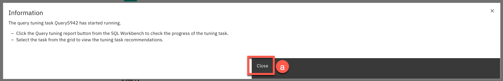

23. From the side menu, select **Workbench (a)**.

    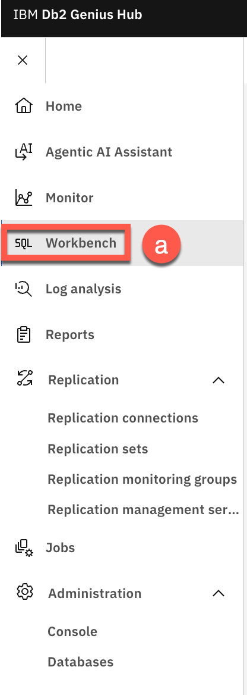

24. In the Workbench, select **Query tuning report (a)**.

    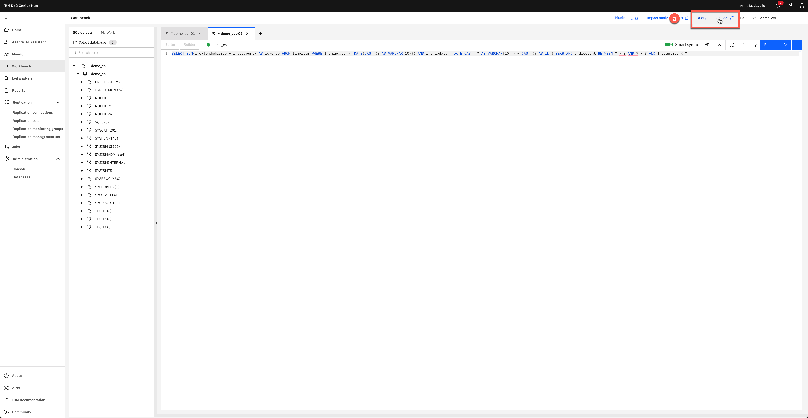

---

<h2 style="padding-left:14px; border-left:6px solid #1D9E75;">Jobs</h2>

You can use Db2 Genius Hub to create and schedule jobs.

1. From the side menu, select **Jobs (e)**.

   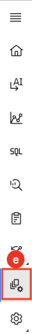

2. Click **Create job (a)**.

   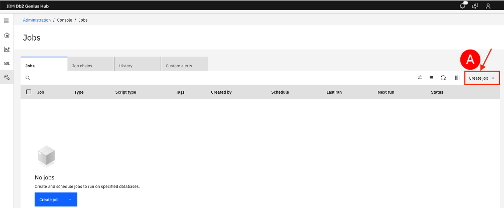

3. In the **Define (a)** tab, enter a **Name (b)**, select **SQL script (c)**, and enter the following SQL in the **Job script text (d)** field:

   ```sql
   SELECT * FROM
      SYSIBM.TABLES,SYSIBM.TABLES,SYSIBM.TABLES,SYSIBM.TABLES,SYSIBM.TABLES,
      SYSIBM.TABLES,SYSIBM.TABLES,SYSIBM.TABLES,SYSIBM.TABLES,SYSIBM.TABLES,
      SYSIBM.TABLES,SYSIBM.TABLES
   ;
   ```

   > **⚠️ Caution:** This is a Cartesian product query designed to generate CPU load. Do not add more table references than shown — too many will overload the system.

   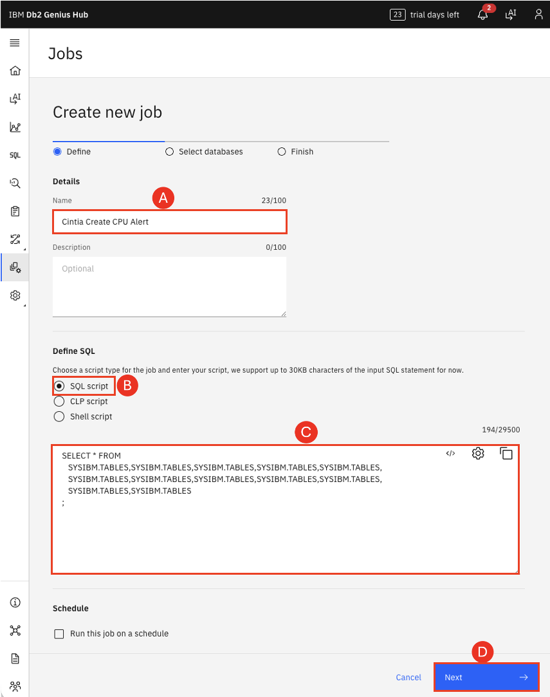

4. Scroll down and click **Next (e)**.
  
5. In the **Select databases (a)** tab, select **Personal credential (b)** and select **`demo_col` (c)**. Click **Next (d)**.

   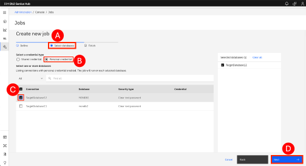

6. Review the summary and click **Finish (a)**.

   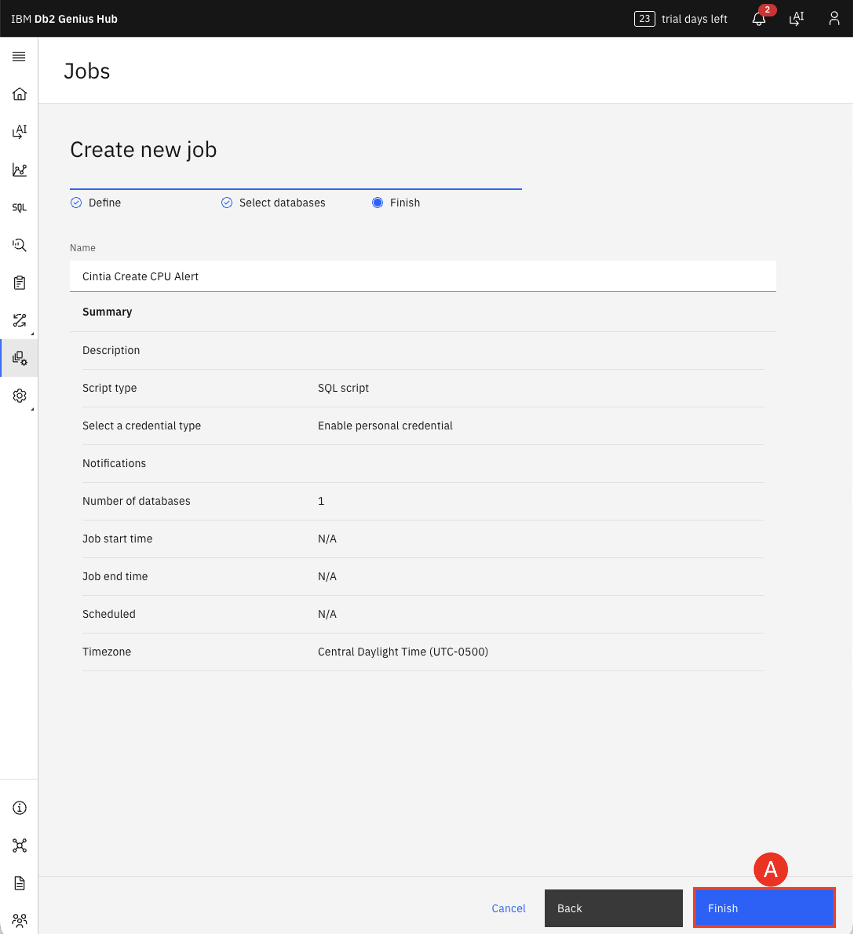

7. A message confirms the job was created successfully.

   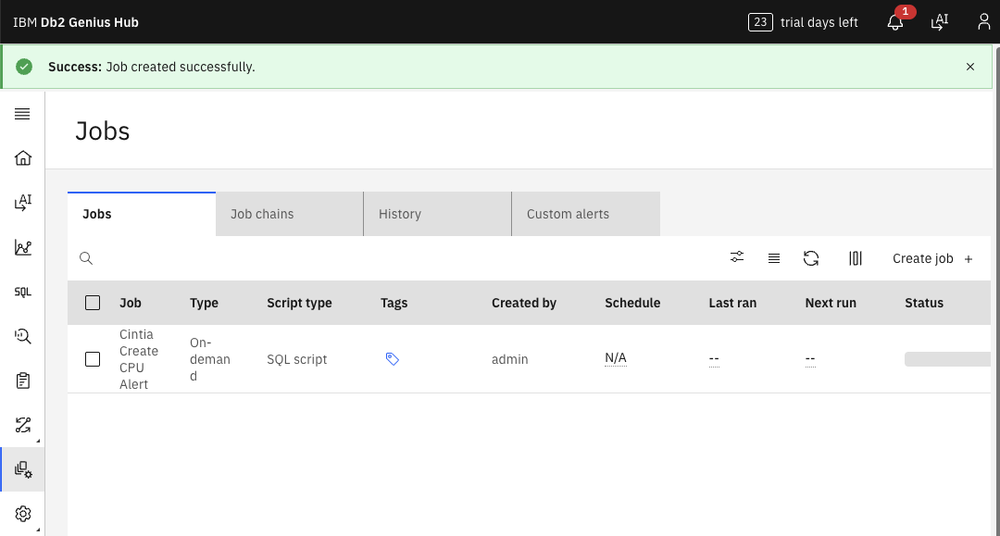

8. From the **Jobs** page, click the **3 dots (a)** on the right side of the job and select **Run with existing credentials (b)**.

   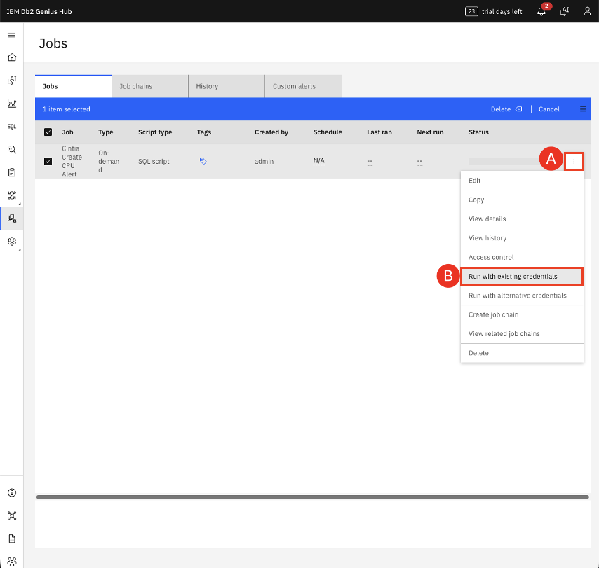

9. Wait until you see the alert **(a)** in the upper-right corner.

    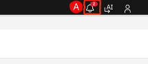

10. When the alert appears, stop the job to avoid excessive CPU consumption. Select your job **(a)** and click **Stop (b)**.

    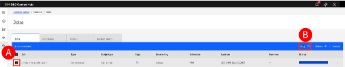

11. The **Stop job** window opens. Click **Stop (a)**.

    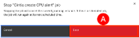

12. Delete the job. Select your job **(a)** and click **Delete (b)**.

    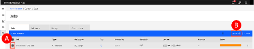

13. Return to the Monitor dashboard by clicking **Monitor (c)** from the side menu.

    

14. Select the **CPU time (a)** alert. The alert details **(b)** are displayed.

    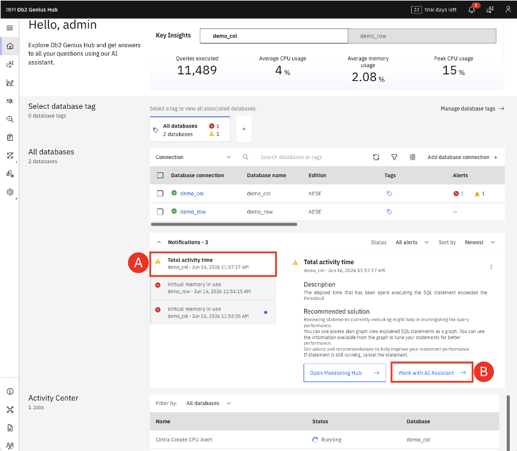

15. Click **Work with Database Assistant (a)**. The Database Assistant opens on the right side. Review the recommendation.

    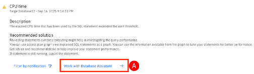

16. **Write down the recommendation** from the Database Assistant.

17. You can also view the recommendation from the Notification Center. Click the **alert (a)** icon in the upper-right corner.

    

18. The **Notification Center** summary window opens. Click **View notification center (a)**.

    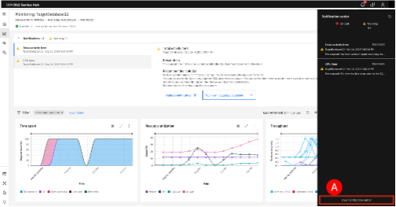

19. The **Notification Center** window opens. Select the **CPU time (a)** alert and review the alert details **(b)** on the right side.

    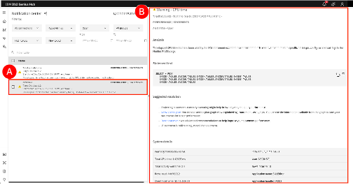

    From the recommendation you can view the access plan or tune the statement — capabilities covered in the Visual Explain and Query Tuning sections.

---

---

**[← Agentic AI Assistant](04-03-agentic-ai-assistant.md)** &nbsp;&nbsp;|&nbsp;&nbsp; **[→ Agentic AI Simulator](05-agentic-ai-simulator.md)**

---
